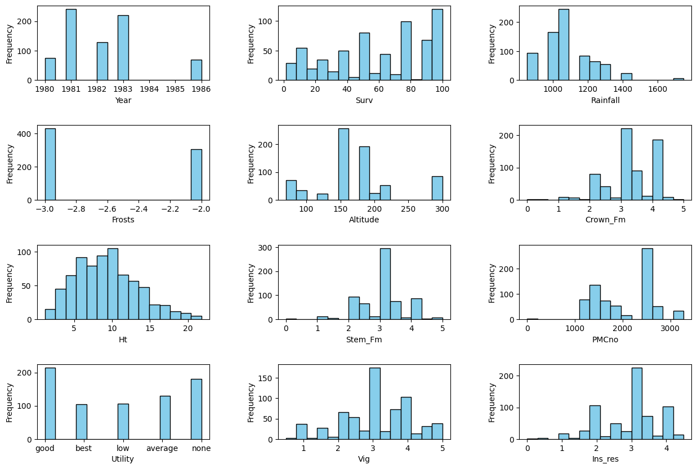

# Machine Learning - Exercise 1 Report
## Authors:
- Nicolas Bernal (12347489)
- Richard Binder (01425185)
- Victor Olusesi (11776826)

# Dataset #1 - Breast Cancer

## Exploratory

### Description of the dataset
The "Breast cancer diagnostic" dataset contains 32 attributes and 285 instances. The attributes and instances are described as follows:

- Instances:
    - Training: 213 instances (75% of the dataset)
    - Validation: 72 instances (25% of the dataset)
    - Total: 285 instances
- Attributes:
    - id:
        - `Description`: ID of the person.
        - `Type`: integer
    - class:
        - `Description`: Diagnosis of the person, `True` if the person has malignant a tumor, `False` otherwise.
        - `Type`: boolean
    - Attributes 3-32:
        - `Description`: 29 attributes describing the shape, texture, area, etc. of the tumor in the breast; in order to determine whether the tumor is malignant or benign. 
        - `Type`: double

### Visualization of the dataset
In the following histograms we can see the distribution of the attributes in the dataset (on the right) and the distribution of the attributes for the two classes (on the left).

The histograms show that some attributes have a clear separation between the two classes, while others have a significant overlap. This might suggest that the attributes with the highest separation in their distributions might be the ones that are most relevant for the classification, since we can see that the values of these attributes are more likely to be different for the two classes.

### Histograms of the attributes with the `highest` separation between the two classes

### Histograms of the attributes with the `lowest` separation between the two classes

## Preprocessing of the data
- `Missing values`: There are no missing values in the dataset.
- `Scaling`: We will scale the data using the `StandardScaler` from `sklearn.preprocessing`. In order to make the data more suitable for the models, the data will be scaled to have a mean of 0 and a standard deviation of 1.
- `Encoding`: The class attribute will be encoded to 0 and 1, where 0 represents a benign tumor and 1 represents a malignant tumor.
- `Attribute selection`: 
    - We will drop the `id` attribute, as it is irrelevant for the classification.
    - We will use a `RandomForestClassifier` to select the most important features, in order to make some test with a reduced number of features.

## Comparison of different classifiers
### KNN

For the KNN classifier, we made several test with different variations of the hyperparameters (such as the number of neighbors and the distance metric), and also with different ways of preprocessing the data (such as scaling and feature selection). 

To obtain the optimal K for each test, we used cross-validation varying number of folds for each case, and we selected the K with the highest accuracy, doing this proccess with values of K from 1 to 100.

Also, for feature selection, we used a `RandomForestClassifier` to select the most important features, and we made tests with the selected features and with all the features. In this case we decided to pick those features that have an importance greater than 0.05 for one group of tests, and greater than 0.1 for another group of tests.

The selected features are, that have an importance greater than 0.05 are:
- concavePointsWorst
- areaWorst
- concavePointsMean
- radiusWorst
- concavityMean
- perimeterMean
- perimeterWorst
- radiusMean
- areaMean

The selected features are, that have an importance greater than 0.1 are:
- concavePointsWorst
- areaWorst
- concavePointsMean

The results of the tests are shown in the following tables:

#### KNN with all features
| scaling | k             | weights | Accuracy | Precision | Recall | F1  |
|---------|---------------|---------|----------|-----------|--------|-----|
| False   | 10            | uniform | 0.916    | 0.94      | 0.90   | 0.914|
| False   | 10            | distance| 0.93     | 0.95      | 0.92   | 0.929|
| False   | 5 ("Optimal") | uniform | 0.93     | 0.94      | 0.92   | 0.929|
| False   | 5 ("Optimal") | distance| 0.94     | 0.95      | 0.94   | 0.944|
| True    | 10            | uniform | 0.94     | 0.96      | 0.93   | 0.943|
| True    | 10            | distance| 0.94     | 0.96      | 0.93   | 0.943|
| True    | 19 ("Optimal") | uniform | 0.972   | 0.98      | 0.97   | 0.972|
| True    | 19 ("Optimal") | distance| 0.972   | 0.98      | 0.97   | 0.972|

#### KNN with feature selection (importance > 0.05)
| scaling | k             | weights | Accuracy | Precision | Recall | F1  |
|---------|---------------|---------|----------|-----------|--------|-----|
| False   | 10            | uniform | 0.916    | 0.94      | 0.90   | 0.914|
| False   | 10            | distance| 0.93     | 0.946     | 0.916  | 0.929|
| False   | 5 ("Optimal") | uniform | 0.93     | 0.94      | 0.92   | 0.929|
| False   | 5 ("Optimal") | distance| 0.944    | 0.948     | 0.938  | 0.944|
| True    | 10            | uniform | 0.944    | 0.95      | 0.94   | 0.944|
| True    | 10            | distance| 0.958    | 0.959     | 0.954  | 0.958|
| True    | 18 ("Optimal")| uniform | 0.972    | 0.98      | 0.97   | 0.972|
| True    | 18 ("Optimal")| distance| 0.972    | 0.972     | 0.966  | 0.972|

#### KNN with feature selection (importance > 0.1)
| scaling | k             | weights | Accuracy | Precision | Recall | F1  |
|---------|---------------|---------|----------|-----------|--------|-----|
| False   | 10            | uniform | 0.88     | 0.906     | 0.87   | 0.886|
| False   | 10            | distance| 0.88     | 0.906     | 0.87   | 0.886|
| False   | 9 ("Optimal") | uniform | 0.902    | 0.907     | 0.89   | 0.901|
| False   | 9 ("Optimal") | distance| 0.88     | 0.906     | 0.87   | 0.886|
| True    | 10            | uniform | 0.94     | 0.95      | 0.94   | 0.944|
| True    | 10            | distance| 0.958    | 0.959     | 0.954  | 0.958|
| True    | 3 ("Optimal") | uniform | 0.94     | 0.95      | 0.94   | 0.944|
| True    | 3 ("Optimal") | distance| 0.94     | 0.948     | 0.938  | 0.944|

With the results of the tests, some interesting points can be observed. First of all, the ideal value of k is very susceptible to changes in the data, if we scale the data or perform feature selection, the optimal value of k changes.

Scaled data generally performs better than unscaled data, this is expected since the KNN algorithm is based on the distance between the samples, and if the data is not scaled, the distance between the samples can be biased by the scale of the features.

The weight parameter of the KNN algorithm also has an impact on the performance of the model specially when the data is not scaled. In general, the distance weight performs better than the uniform weight, since the distance weight gives more importance to the samples that are closer to the query sample, rather than giving the same importance to all the samples. Which is important in this case, since the values of the features are not in the same scale.

### Neural Networks

For neural networks we made several tests with different hyperparameters, such as the number of hidden layers, the activation function, the solver, and the scaling of the data. We also made tests with all the features and with the features selected by the `RandomForestClassifier` with an importance greater than 0.05 and 0.1.

For the first part of test, we tried different combinations of hyperparameters (activation and solver) and we made tests with and without scaling the data. The results of the tests are shown in the following tables:

#### Neural network with all features
##### Neural network with all features and no scaling
| scaling   | hidden_layers   | activation   | solver   |   Accuracy |   Precision |   Recall |       F1 |
|:----------|:----------------|:-------------|:---------|-----------:|------------:|---------:|---------:|
| False     | (5, 3)          | relu         | adam     |   0.819444 |    0.860477 | 0.788095 | 0.809631 |
| False     | (5, 3)          | relu         | lbfgs    |   0.583333 |    0.291667 | 0.5      | 0.429825 |
| False     | (5, 3)          | relu         | sgd      |   0.583333 |    0.291667 | 0.5      | 0.429825 |
| False     | (5, 3)          | identity     | adam     |   0.819444 |    0.860477 | 0.788095 | 0.809631 |
| False     | (5, 3)          | identity     | lbfgs    |   0.583333 |    0.291667 | 0.5      | 0.429825 |
| False     | (5, 3)          | identity     | sgd      |   0.916667 |    0.926421 | 0.904762 | 0.915584 |
| False     | (5, 3)          | logistic     | adam     |   0.861111 |    0.903846 | 0.833333 | 0.85461  |
| False     | (5, 3)          | logistic     | lbfgs    |   0.875    |    0.885532 | 0.859524 | 0.872829 |
| False     | (5, 3)          | logistic     | sgd      |   0.583333 |    0.291667 | 0.5      | 0.429825 |
| False     | (5, 3)          | tanh         | adam     |   0.916667 |    0.926421 | 0.904762 | 0.915584 |
| False     | (5, 3)          | tanh         | lbfgs    |   0.583333 |    0.291667 | 0.5      | 0.429825 |
| False     | (5, 3)          | tanh         | sgd      |   0.625    |    0.804348 | 0.55     | 0.517199 |

With the results of the tests, we can see that the best results were obtained with the following hyperparameters:
- Hyperparameters #1:
    - `activation`: identity
    - `solver`: sgd
    - `F1-score`: 0.915584
- Hyperparameters #2:
    - `activation`: tanh
    - `solver`: adam
    - `F1-score`: 0.915584

This results suggest some interesting points:
- For the first configuration, the best results were obtained with the `identity` activation function and the `sgd` solver, shows that the `identity` activation function (which is basically lineal function) showed some synergy with the `sgd` solver, which in (general) work well with non scaled data. 
- In general the `lbfgs` solver showed bad results, since it is a solver that works well with small dimensions, but in this case we are working with 29 features.

##### Neural network with all features and scaling
| scaling   | hidden_layers   | activation   | solver   |   Accuracy |   Precision |   Recall |       F1 |
|:----------|:----------------|:-------------|:---------|-----------:|------------:|---------:|---------:|
| True      | (5, 3)          | relu         | adam     |   0.972222 |    0.977273 | 0.966667 | 0.972066 |
| True      | (5, 3)          | relu         | lbfgs    |   0.958333 |    0.955547 | 0.959524 | 0.958424 |
| True      | (5, 3)          | relu         | sgd      |   0.944444 |    0.956522 | 0.933333 | 0.943723 |
| True      | (5, 3)          | identity     | adam     |   0.972222 |    0.977273 | 0.966667 | 0.972066 |
| True      | (5, 3)          | identity     | lbfgs    |   0.944444 |    0.940625 | 0.947619 | 0.944663 |
| True      | (5, 3)          | identity     | sgd      |   0.972222 |    0.977273 | 0.966667 | 0.972066 |
| True      | (5, 3)          | logistic     | adam     |   0.972222 |    0.977273 | 0.966667 | 0.972066 |
| True      | (5, 3)          | logistic     | lbfgs    |   0.958333 |    0.955547 | 0.959524 | 0.958424 |
| True      | (5, 3)          | logistic     | sgd      |   0.583333 |    0.291667 | 0.5      | 0.429825 |
| True      | (5, 3)          | tanh         | adam     |   0.972222 |    0.977273 | 0.966667 | 0.972066 |
| True      | (5, 3)          | tanh         | lbfgs    |   0.958333 |    0.955547 | 0.959524 | 0.958424 |
| True      | (5, 3)          | tanh         | sgd      |   0.972222 |    0.977273 | 0.966667 | 0.972066 |

With the results of the tests, we can see that the best results were obtained with the following hyperparameters:
- Hyperparameters #1:
    - `activation`: relu
    - `solver`: adam
    - `F1-score`: 0.972066
- Hyperparameters #2:
    - `activation`: identity
    - `solver`: adam & sgd
    - `F1-score`: 0.972066
- Hyperparameters #3:
    - `activation`: tanh
    - `solver`: adam & sgd
    - `F1-score`: 0.972066

In general the results obtained after scaling the data are better than the results obtained without scaling it. This is expected since the neural network works better with scaled data, since the weights are updated in a more efficient way which helps to converge faster to an optimal solution. 

With the results of the tests, we can see that the best result for `F1-score` was ~0.972 with the hyperparameters mentioned before. This results suggest that this is the maximum performance that we can obtain with the current preprocessing and architecture of the neural network.

### Neural network with feature selection

For this part of the test, we took the best hyperparameters and we made tests with the features selected by the `RandomForestClassifier` with an importance greater than 0.05 and 0.1. In this case we decided to only apply the scaling to the data, since it gave the best results in the previous tests. The results of the tests are shown in the following tables:

#### Scaling - feature selection #1 (importance > 0.05)
| scaling   | hidden_layers   | activation   | solver   |   Accuracy |   Precision |   Recall |       F1 |
|:----------|:----------------|:-------------|:---------|-----------:|------------:|---------:|---------:|
| True      | (5, 3)          | relu         | adam     |   0.972222 |    0.977273 | 0.966667 | 0.972066 |
| True      | (5, 3)          | identity     | adam     |   0.958333 |    0.959503 | 0.954762 | 0.958225 |
| True      | (5, 3)          | identity     | sgd      |   0.958333 |    0.959503 | 0.954762 | 0.958225 |
| True      | (5, 3)          | tanh         | adam     |   0.958333 |    0.959503 | 0.954762 | 0.958225 |
| True      | (5, 3)          | tanh         | sgd      |   0.958333 |    0.959503 | 0.954762 | 0.958225 |

#### Scaling - feature selection #2 (importance > 0.1)
| scaling   | hidden_layers   | activation   | solver   |   Accuracy |   Precision |   Recall |       F1 |
|:----------|:----------------|:-------------|:---------|-----------:|------------:|---------:|---------:|
| True      | (5, 3)          | relu         | adam     |   0.583333 |    0.291667 | 0.5      | 0.429825 |
| True      | (5, 3)          | identity     | adam     |   0.944444 |    0.948052 | 0.938095 | 0.944133 |
| True      | (5, 3)          | identity     | sgd      |   0.930556 |    0.937037 | 0.921429 | 0.929925 |
| True      | (5, 3)          | tanh         | adam     |   0.944444 |    0.948052 | 0.938095 | 0.944133 |
| True      | (5, 3)          | tanh         | sgd      |   0.930556 |    0.937037 | 0.921429 | 0.929925 |

#### Comparison of the results of the neural network with feature selection #1 (importance > 0.05) and the neural network with feature selection #2 (importance > 0.1):

Comparing the results of the neural network with feature selection #1 (importance > 0.05) and the neural network with feature selection #2 (importance > 0.1), we can see that the results are a little worse in most cases when we use the features with an importance greater than 0.1 (3 attributes). Also, there is a significant decrease in performance in the fist configuration, where the F1-score is 0.429825, which was the best result obtained in the previous case (importance > 0.05).

The decrease in performance in feature selection #2 (importance > 0.1) is expected, since we are using only 3 features, which are apparently enough to obtain a good performance in the classification task, but we are still losing valuable relations between features that could help to improve the performance of the model.

These results suggest that the features with an importance greater than 0.05 (9 features) are good enough to obtain a good performance in the classification task, since the results are similar to the ones obtained with all the features, and the best results in both cases are the same. This is good because it means that we can reduce the number of features without losing much performance in this task.

### Testing others architectures of the neural network with all features

For the las part of the test, we made tests with different architectures of the neural network, varying the number of hidden layers and the number of neurons in each layer. We used all the features and we applied the scaling to the data since this way of preprocessing gave the best results in the previous tests. The results of the tests are shown in the following tables:

| scaling   | hidden_layers         | activation   | solver   |   Accuracy |   Precision |   Recall |       F1 |
|:----------|:----------------------|:-------------|:---------|-----------:|------------:|---------:|---------:|
| True      | (8, 9)                | relu         | adam     |   0.944444 |    0.956522 | 0.933333 | 0.943723 |
| True      | (8, 9)                | relu         | sgd      |   0.972222 |    0.977273 | 0.966667 | 0.972066 |
| True      | (8, 9)                | identity     | adam     |   0.972222 |    0.977273 | 0.966667 | 0.972066 |
| True      | (8, 9)                | identity     | sgd      |   0.972222 |    0.977273 | 0.966667 | 0.972066 |
| True      | (8, 9)                | tanh         | adam     |   0.972222 |    0.977273 | 0.966667 | 0.972066 |
| True      | (8, 9)                | tanh         | sgd      |   0.972222 |    0.977273 | 0.966667 | 0.972066 |
| True      | (1, 3, 5, 3, 1)       | relu         | adam     |   0.583333 |    0.291667 | 0.5      | 0.429825 |
| True      | (1, 3, 5, 3, 1)       | relu         | sgd      |   0.583333 |    0.291667 | 0.5      | 0.429825 |
| True      | (1, 3, 5, 3, 1)       | identity     | adam     |   0.972222 |    0.977273 | 0.966667 | 0.972066 |
| True      | (1, 3, 5, 3, 1)       | identity     | sgd      |   0.972222 |    0.977273 | 0.966667 | 0.972066 |
| True      | (1, 3, 5, 3, 1)       | tanh         | adam     |   0.583333 |    0.291667 | 0.5      | 0.429825 |
| True      | (1, 3, 5, 3, 1)       | tanh         | sgd      |   0.583333 |    0.291667 | 0.5      | 0.429825 |
| True      | (10, 10, 10)          | relu         | adam     |   0.986111 |    0.988372 | 0.983333 | 0.986075 |
| True      | (10, 10, 10)          | relu         | sgd      |   0.972222 |    0.977273 | 0.966667 | 0.972066 |
| True      | (10, 10, 10)          | identity     | adam     |   0.986111 |    0.988372 | 0.983333 | 0.986075 |
| True      | (10, 10, 10)          | identity     | sgd      |   0.986111 |    0.988372 | 0.983333 | 0.986075 |
| True      | (10, 10, 10)          | tanh         | adam     |   0.986111 |    0.988372 | 0.983333 | 0.986075 |
| True      | (10, 10, 10)          | tanh         | sgd      |   0.972222 |    0.977273 | 0.966667 | 0.972066 |
| True      | (50, 40, 60, 80, 100) | relu         | adam     |   0.972222 |    0.971429 | 0.971429 | 0.972222 |
| True      | (50, 40, 60, 80, 100) | relu         | sgd      |   0.986111 |    0.988372 | 0.983333 | 0.986075 |
| True      | (50, 40, 60, 80, 100) | identity     | adam     |   0.944444 |    0.940625 | 0.947619 | 0.944663 |
| True      | (50, 40, 60, 80, 100) | identity     | sgd      |   0.972222 |    0.971429 | 0.971429 | 0.972222 |
| True      | (50, 40, 60, 80, 100) | tanh         | adam     |   0.944444 |    0.940625 | 0.947619 | 0.944663 |
| True      | (50, 40, 60, 80, 100) | tanh         | sgd      |   0.972222 |    0.971429 | 0.971429 | 0.972222 |

With this tests, we can notice that we got an improvement of the performance of the neural network when we increased the number of neurons in the hidden layers. The best results were obtained with the architecture (10, 10, 10) and in one case with the architecture (50, 40, 60, 80, 100), where the F1-score was 0.986075. This results suggest that the previous architectures were not enough to capture the complexity of the data, and that bigger architectures (more neurons and or more layers) were needed to improve performance in the classification task.

Also, we can see that just increasing the number of neurons in the hidden layers is not enough to improve the performance of the neural network, actually in some cases the performance decreased. We can see in 4/6 cases of the architecture (1, 3, 5, 3, 1) that the performance was significantly worse than most of the previous tests with smaller architectures (3, 5). We have the hypothesis that this might be caused by the layers with less neurons, which might be too small to capture the complexity of the data.

### Random Forest

For the Random Forest classifier model, we made some tests with different hyperparameters, as the maximun leaf nodes, the maximun features and the maximun depth of the trees. As in the previous models, we made tests with all the features and with the features selected by a `RandomForestClassifier` with an importance greater than 0.05 and 0.1.

#### Random Forest with all features
| scaling   | max_leaf_nodes | max_features | max_depth |Accuracy |Precision | Recall|  F1  |
|:----------|:---------------|:-------------|:----------|--------:|---------:|------:|-----:|
| False     | 2              | 2            | 2         |   0.888 | 0.906 | 0.871 |0.886 |
| False     | 10             | 10           | 10        |   0.972 | 0.977 | 0.966 |0.972 |
| False     | 50             | 31           | 31        |   0.972 | 0.977 | 0.966 |0.972 |
| True      | 2              | 2            | 2         |   0.888 | 0.906 | 0.871 |0.886 |
| True      | 10             | 10           | 10        |   0.972 | 0.977 | 0.966 |0.972 |
| True      | 50             | 31           | 31        |   0.972 | 0.977 | 0.966 |0.972 |

#### Random Forest with feature selection (importance > 0.05)
| scaling   | max_leaf_nodes | max_features | max_depth |Accuracy |Precision | Recall|  F1  |
|:----------|:---------------|:-------------|:----------|--------:|---------:|------:|-----:|
| False     | 2              | 2            | 2         |   0.958 | 0.959 | 0.954 |0.958 |
| False     | 10             | 10           | 10        |   0.958 | 0.959 | 0.954 |0.958 |
| False     | 50             | 31           | 31        |   0.958 | 0.959 | 0.954 |0.958 |
| True      | 2              | 2            | 2         |   0.958 | 0.959 | 0.954 |0.958 |
| True      | 10             | 10           | 10        |   0.958 | 0.959 | 0.954 |0.958 |
| True      | 50             | 31           | 31        |   0.958 | 0.959 | 0.954 |0.958 |

#### Random Forest with feature selection (importance > 0.1)
| scaling   | max_leaf_nodes | max_features | max_depth |Accuracy |Precision | Recall|  F1  |
|:----------|:---------------|:-------------|:----------|--------:|---------:|------:|-----:|
| False     | 2              | 2            | 2         |   0.93  | 0.937 | 0.921 |0.929 |
| False     | 10             | 10           | 10        |   0.944 | 0.948 | 0.938 |0.944 |
| False     | 50             | 31           | 31        |   0.944 | 0.948 | 0.938 |0.944 |
| True      | 2              | 2            | 2         |   0.93  | 0.937 | 0.921 |0.929 |
| True      | 10             | 10           | 10        |   0.944 | 0.948 | 0.938 |0.944 |
| True      | 50             | 31           | 31        |   0.944 | 0.948 | 0.938 |0.944 |

After the tests, we can see that scaling the data does not have any impact on the performance of the classifier, since the results are the same with and without scaling the data. Also, probably due to the simplicity of the dataset and the number of samples, that the trees generated by the Random Forest classifier do not need high complexity to capture the patterns in the data.

It's interesting to note that we obtained the worst results with the smallest configuration (max_leaf_nodes=2, max_features=2, max_depth=2) without feature selection, this is probably due to the simplicity of trees generated by the classifier, plus the complexity of using 29 features to generate the trees. However, not using feature selection with the random forest also gave the best results with more complex configurations (max_leaf_nodes=10, max_features=10, max_depth=10), which means that the classifier was able to capture key patterns of less relevant features to improve the performance of the model.

Finally, we can also see that for this dataset is kinda simple/small to get stuck with the performance of the model, since increasing considerably the complexity of the trees to directly try to overfit the data did not improve the performance of the model.

## Conclusions

### Best results by model:

| Model           | Case         | Scaling | Accuracy | Precision | Recall | F1  |
|-----------------|--------------|---------|----------|-----------|--------|-----|
| KNN             | 9 features   | Yes     | 0.97     | 0.98      | 0.97   |0.972|
| Neural networks | All features | Yes     | 0.98     | 0.98      | 0.98   |0.986|
| Random forest   | All features | No      | 0.97     | 0.97      | 0.96   |0.972|

### Worst results by model:

| Model           | Case         | Scaling | Accuracy | Precision | Recall | F1  |
|-----------------|--------------|---------|----------|-----------|--------|-----|
| KNN             | 3 features   | No      | 0.88     | 0.90      | 0.87   |0.886|
| Neural networks | All features | No      | 0.58     | 0.29      | 0.50   |0.429|
| Random forest   | All features | No      | 0.88     | 0.90      | 0.87   |0.886|

In general, all the models performed well in the classification task, with the best results obtained with the neural network and the worst results obtained with also the neural network. This is expected since the neural network is a more complex model that can capture more complex patterns in the data, but it also needs more data to train properly, and since we are working with a small dataset, is more likely to don't catch the patterns in the data so easily as the other models and therefore perform worse without a complex architecture.

Random forest and KNN performed well in the classification task, in general these models gave good and consistent results with different hyperparameters and preprocessing. 

The KNN classifier performed considerably better with scaled data, which is expected since the algorithm is based on the distance between the samples, and if the data is not scaled, the distance between the samples can be biased by the scale of the features. 

The Random Forest classifier performed better with all the features, which suggests that the classifier was able to capture key patterns of less relevant features to improve the performance of the model. Also, this one required less preprocessing than the other models to perform well in the classification task.

Finally, feature selection had an impact on all tree models. For one hand we could see that taking an important portion of the features (9 features, importance > 0.05) was enough to obtain a good performance in the classification task while reducing the complexity of the model and also computational cost. On the other hand, taking only the most important features (3 features, importance > 0.1) decreased the performance of the models, this is expected since not only we are reducing the complexity of the model, but also we are losing valuable relations between features that could help to improve the performance of the model.

# Dataset #2 - Loan
## Exploratory
### Description of the dataset
The "Loan application" dataset contains 92 attributes and both the training and test set contain 10000 instances each. The target attribute is the "grade" feature, which ranges between A and G. The remaining attributes, not counting the "ID", describe different aspects of a loan application, like the requested amount or the annual income of the applicant.

### visualization
In the following histograms we can see the distribution of the attributes in the dataset for the 10 most important attributes, of which the interest rate is by far the most crucial one, when it comes to determining the loan application.

#### 10 most important attributes of the Loan dataset

## Preprocessing of the data
- `Missing values`: There are no missing values in the dataset.
- `Scaling`: We will scale the data using the `StandardScaler` from `sklearn.preprocessing`. In order to make the data more suitable for the models, the data will be scaled to have a mean of 0 and a standard deviation of 1.
- `Encoding`: The class attribute will be lable encoded, where 0 represents an A grade, 1 a B grade and so on. Categorical attributes, like the `home_ownership` or `purpose` will be one hot encoded. All the remaining attributes, which are numerical values, will be scaled between -1 and 1
- `Attribute selection`: 
    - We will drop the `id` attribute, as it is irrelevant for the classification.
    - Further we will drop the following attributes for not adding meaningful information, as barerly every instance (>99.9%) shares the same value: `pymnt_plan`, `hardship_flag`, `policy_code`.
    - Since the amount of attributes is quite large, we will use a `RandomForestClassifier` to determine the most important attributes and therefore drop several unimportant ones, right from the beginning.
    - We will make further tests, where we will use the `RandomForestClassifier` and an importance threshhold of 0.01, 0.015 and 0.02, meaning that every attribute below the threshhold will be dropped.

With only one hot encoding of some attributes and lable encoding the grade and dropping 10 or so attributes we get super low accuracy.

## Results
### KNN

For the KNN classifier in combination with the loan dataset, we made the following tests. We first used the Dataset with only the modifications mentioned above, then we used the same dataset but without scaling and finally we used the dataset with certain attributes dropped as explained earlier. For each of those we alternated between using the `uniform` and `distance` setting for the weights. We also made tests with 5, 10 and the optimal value for the neighbors (k). For the cross validation we took the splitting value 5 for each test.

#### KNN All features
| scaling | k              | weights  | accuracy | precision | recall   | f1_score | avg_cross | runtime_holdout | runtime_cross |
| ------- | ---            | -------- | -------- | --------- | -------- | -------- | --------- | --------------- | ------------- |
| True    | 13 ("Optimal") | uniform  | 0.395    | 0.276139  | 0.240458 | 0.362776 | 0.387800  | 0.6875          | 1.484375      |
| True    | 15 ("Optimal") | distance | 0.398    | 0.234735  | 0.235989 | 0.369370 | 0.3996    | 0.21875         | 1.609375      |
| True    | 5              | uniform  | 0.391    | 0.418898  | 0.256410 | 0.364270 | 0.3719    | 0.625           | 1.234375      |
| True    | 10             | uniform  | 0.377    | 0.252202  | 0.229392 | 0.346841 | 0.383200  | 0.65625         | 1.515625      |
| False   | 17             | uniform  | 0.334    | 0.326540  | 0.193620 | 0.301402 | 0.3195    | 0.71875         | 1.609375      |
| False   | 10             | distance | 0.342    | 0.234906  | 0.204905 | 0.322429 | 0.3151    | 0.25            | 1.484375      |
| False   | 5              | uniform  | 0.316    | 0.334999  | 0.199847 | 0.295386 | 0.302     | 0.546875        | 1.46875       |
| False   | 10             | uniform  | 0.331    | 0.238360  | 0.199352 | 0.308133 | 0.3122    | 0.671875        | 1.5625        |

#### KNN Features with importance <0.01 dropped
| scaling | k              | weights  | accuracy | precision | recall   | f1_score | avg_cross | runtime_holdout | runtime_cross |
| ------- | ---            | -------- | -------- | --------- | -------- | ---------| --------- | --------------- | ------------- |
| True    | 17 ("Optimal") | uniform  | 0.557    | 0.390044  | 0.348131 | 0.530821 | 0.547300  | 0.625           | 0.890625      |
| True    | 9 ("Optimal")  | distance | 0.575    | 0.496415  | 0.391234 | 0.561423 | 0.549500  | 0.109375        | 0.703125      |
| True    | 5              | uniform  | 0.536    | 0.371356  | 0.344722 | 0.515736 | 0.520400  | 0.390625        | 0.671875      |
| True    | 10             | uniform  | 0.549    | 0.377437  | 0.342108 | 0.524174 | 0.538     | 0.46875         | 0.71875       |

#### KNN Features with importance <0.015 dropped
| scaling | k              | weights  | accuracy | precision | recall   | f1_score | avg_cross | runtime_holdout | runtime_cross |
| ------- | ---            | -------- | -------- | --------- | -------  | -------- | --------- | --------------- | ------------- |
| True    | 15 ("Optimal") | uniform  | 0.804    | 0.580975  | 0.558948 | 0.793379 | 0.8041    | 0.109375        | 0.953125      |
| True    | 12 ("Optimal") | distance | 0.81     | 0.748677  | 0.590682 | 0.802252 | 0.8082    | 0.046875        | 0.25          |
| True    | 5              | uniform  | 0.793    | 0.739807  | 0.590509 | 0.786113 | 0.7965    | 0.09375         | 0.859375      |
| True    | 10             | uniform  | 0.787    | 0.702714  | 0.558854 | 0.776777 | 0.800900  | 0.09375         | 0.921875      |

### KNN Features with importance <0.02 dropped
| scaling | k              | weights  | accuracy | precision | recall   | f1_score | avg_cross | runtime_holdout | runtime_cross |
| ------- | ---            | -------- | -------- | --------- | -------  | -------- | --------- | --------------- | ------------- |
| True    | 15 ("Optimal") | uniform  | 0.859    | 0.657848  | 0.622020 | 0.851054 | 0.8637    | 0.078125        | 0.734375      |
| True    | 18 ("Optimal") | distance | 0.861    | 0.819618  | 0.646044 | 0.854941 | 0.873499  | 0.015625        | 0.078125      |
| True    | 5              | uniform  | 0.844    | 0.808206  | 0.649476 | 0.839222 | 0.865500  | 0.0625          | 0.71875       |
| True    | 10             | uniform  | 0.856    | 0.790931  | 0.625466 | 0.848038 | 0.864899  | 0.078125        | 0.703125      |

As this was a very feature heavy dataset, we expected that dropping several attributes would significantly improve the classification, which it did. The improvement can also be found in every metric that we measured. The best performing setting for both the holdout and cross validation was the one, where we dropped every attribute with importance <0.02, used the optimal k and set the weights to `distance`. Also the in general the cross validation performed better than the holdout method. Another noticeable aspect is the reduction in runtime the more attributes are left out, which also makes sense, as less data needs to be processed. Similar to our previous dataset, using the unscaled dataset causes a drop in all result metrics, since again the larger numbers tamper with the distances in the model.

In comparison to the other two classifications, which will be discussed below, the KNN classification was the most sensitive to changes in the dataset and performed very poorly, if almost no preprocessing was done.

### Neural Network
For the combination of the loan dataset and the Neural Network classification, we used the following settings and datasets for our tests. In comparison to the KNN classification we did not use the dataset, where we dropped every attribute with importance below 0.02 and we also left out the unscaled dataset. Instead, we focused on trying out multiple combinations of settings the model offers. For the hidden layers we tested a (5,3) and (20, 10, 5) structure, for the activation we alternated between `relu`, `identity`, `logistic` and `tanh`, and for the solver we tested `adam`, `lbfgs` and `sgd`.

#### Neural Network All features
| scaling   | hidden_layers   | activation   | solver   |   accuracy |   precision |   recall |   f1_score |   avg_cross |   runtime_holdout |   runtime_cross |
|:----------|:----------------|:-------------|:---------|-----------:|------------:|---------:|-----------:|------------:|------------------:|----------------:|
| True      | (5, 3)          | relu         | adam     |      0.854 |   0.578222  | 0.600925 |   0.844222 |      0.8516 |           3.25    |         9.42188 |
| True      | (5, 3)          | relu         | lbfgs    |      0.774 |   0.437854  | 0.484996 |   0.740539 |      0.767  |           1.60938 |         6.89062 |
| True      | (5, 3)          | relu         | sgd      |      0.761 |   0.433151  | 0.479474 |   0.728693 |      0.6646 |           2.98438 |         8.07812 |
| True      | (5, 3)          | identity     | adam     |      0.869 |   0.660553  | 0.65582  |   0.864116 |      0.8709 |           2.90625 |         8.03125 |
| True      | (5, 3)          | identity     | lbfgs    |      0.883 |   0.849155  | 0.730724 |   0.879921 |      0.876  |           1.01562 |         6.14062 |
| True      | (5, 3)          | identity     | sgd      |      0.844 |   0.619185  | 0.5847   |   0.833409 |      0.8542 |           2.67188 |         7.32812 |
| True      | (5, 3)          | logistic     | adam     |      0.806 |   0.457142  | 0.509584 |   0.771598 |      0.8182 |           3.04688 |         9.28125 |
| True      | (5, 3)          | logistic     | lbfgs    |      0.803 |   0.457554  | 0.505333 |   0.769305 |      0.8036 |           1.28125 |         6.70312 |
| True      | (5, 3)          | logistic     | sgd      |      0.347 |   0.0972142 | 0.172368 |   0.246318 |      0.3416 |           2.875   |         8.79688 |
| True      | (5, 3)          | tanh         | adam     |      0.864 |   0.585285  | 0.608631 |   0.854918 |      0.8562 |           2.82812 |         8.40625 |
| True      | (5, 3)          | tanh         | lbfgs    |      0.853 |   0.586197  | 0.606119 |   0.842702 |      0.8429 |           0.71875 |         6.65625 |
| True      | (5, 3)          | tanh         | sgd      |      0.737 |   0.412323  | 0.455305 |   0.702184 |      0.7317 |           2.64062 |         7.48438 |
| True      | (20, 10, 5)     | relu         | adam     |      0.84  |   0.640223  | 0.643493 |   0.83523  |      0.8475 |           5.5     |        19.0469  |
| True      | (20, 10, 5)     | relu         | lbfgs    |      0.872 |   0.661183  | 0.655614 |   0.867181 |      0.8657 |           2.59375 |         9.60938 |
| True      | (20, 10, 5)     | relu         | sgd      |      0.831 |   0.567052  | 0.581367 |   0.820609 |      0.8165 |           5.25    |        17.3906  |
| True      | (20, 10, 5)     | identity     | adam     |      0.869 |   0.674131  | 0.673593 |   0.865061 |      0.8703 |           4.89062 |        17.5156  |
| True      | (20, 10, 5)     | identity     | lbfgs    |      0.867 |   0.666363  | 0.67455  |   0.863067 |      0.8759 |           2.23438 |        10.4688  |
| True      | (20, 10, 5)     | identity     | sgd      |      0.863 |   0.641527  | 0.633923 |   0.857065 |      0.8708 |           4.875   |        15.8281  |
| True      | (20, 10, 5)     | logistic     | adam     |      0.809 |   0.459201  | 0.508983 |   0.77409  |      0.831  |           6.3125  |        23.5781  |
| True      | (20, 10, 5)     | logistic     | lbfgs    |      0.809 |   0.557159  | 0.577522 |   0.79995  |      0.8084 |           3.32812 |        14.6719  |
| True      | (20, 10, 5)     | logistic     | sgd      |      0.304 |   0.0434286 | 0.142857 |   0.141742 |      0.2989 |           5.15625 |        19.4531  |
| True      | (20, 10, 5)     | tanh         | adam     |      0.826 |   0.562806  | 0.580612 |   0.816443 |      0.8088 |           5.42188 |        19.0781  |
| True      | (20, 10, 5)     | tanh         | lbfgs    |      0.788 |   0.542264  | 0.5585   |   0.778317 |      0.7828 |           2.15625 |        11.3438  |
| True      | (20, 10, 5)     | tanh         | sgd      |      0.78  |   0.441107  | 0.490844 |   0.745859 |      0.7856 |           5.15625 |        18.5     |

#### Neural Network Features with importance <0.01 dropped
| scaling   | hidden_layers   | activation   | solver   |   accuracy |   precision |   recall |   f1_score |   avg_cross |   runtime_holdout |   runtime_cross |
|:----------|:----------------|:-------------|:---------|-----------:|------------:|---------:|-----------:|------------:|------------------:|----------------:|
| True      | (5, 3)          | relu         | adam     |      0.834 |   0.576991  | 0.597675 |   0.822934 |      0.848  |          1.625    |         6.79688 |
| True      | (5, 3)          | relu         | lbfgs    |      0.847 |   0.586974  | 0.609935 |   0.837338 |      0.8403 |          0.46875  |         2.03125 |
| True      | (5, 3)          | relu         | sgd      |      0.772 |   0.436577  | 0.481494 |   0.737    |      0.792  |          1.45312  |         5.96875 |
| True      | (5, 3)          | identity     | adam     |      0.852 |   0.648738  | 0.622538 |   0.845121 |      0.8671 |          1.45312  |         6.15625 |
| True      | (5, 3)          | identity     | lbfgs    |      0.859 |   0.677378  | 0.675145 |   0.854016 |      0.8698 |          0.46875  |         1.78125 |
| True      | (5, 3)          | identity     | sgd      |      0.841 |   0.570048  | 0.581381 |   0.829134 |      0.8571 |          1.3125   |         5.48438 |
| True      | (5, 3)          | logistic     | adam     |      0.804 |   0.456077  | 0.505502 |   0.768883 |      0.8306 |          1.89062  |         7.57812 |
| True      | (5, 3)          | logistic     | lbfgs    |      0.864 |   0.58963   | 0.599837 |   0.852777 |      0.8631 |          0.671875 |         2.84375 |
| True      | (5, 3)          | logistic     | sgd      |      0.387 |   0.109416  | 0.192279 |   0.274777 |      0.3081 |          1.73438  |         7.17188 |
| True      | (5, 3)          | tanh         | adam     |      0.809 |   0.459626  | 0.507215 |   0.774125 |      0.8321 |          1.5625   |         6.57812 |
| True      | (5, 3)          | tanh         | lbfgs    |      0.855 |   0.588135  | 0.604383 |   0.844611 |      0.8614 |          0.546875 |         2.04688 |
| True      | (5, 3)          | tanh         | sgd      |      0.788 |   0.445942  | 0.495764 |   0.753172 |      0.806  |          1.45312  |         5.95312 |
| True      | (20, 10, 5)     | relu         | adam     |      0.865 |   0.814849  | 0.675613 |   0.861041 |      0.8665 |          2.23438  |         9.375   |
| True      | (20, 10, 5)     | relu         | lbfgs    |      0.86  |   0.67718   | 0.635117 |   0.85302  |      0.8651 |          1.07812  |         4.85938 |
| True      | (20, 10, 5)     | relu         | sgd      |      0.746 |   0.491537  | 0.466651 |   0.71429  |      0.7622 |          2.03125  |         8.75    |
| True      | (20, 10, 5)     | identity     | adam     |      0.851 |   0.67221   | 0.66097  |   0.845839 |      0.8686 |          1.5625   |         6.89062 |
| True      | (20, 10, 5)     | identity     | lbfgs    |      0.852 |   0.816712  | 0.678439 |   0.8477   |      0.8697 |          1.03125  |         3.35938 |
| True      | (20, 10, 5)     | identity     | sgd      |      0.851 |   0.647842  | 0.627498 |   0.844379 |      0.865  |          1.71875  |         7.07812 |
| True      | (20, 10, 5)     | logistic     | adam     |      0.814 |   0.463265  | 0.512046 |   0.779022 |      0.8326 |          3.21875  |        14.0156  |
| True      | (20, 10, 5)     | logistic     | lbfgs    |      0.859 |   0.588896  | 0.604863 |   0.848935 |      0.857  |          2.28125  |         8.78125 |
| True      | (20, 10, 5)     | logistic     | sgd      |      0.304 |   0.0434286 | 0.142857 |   0.141742 |      0.2989 |          3        |        13.3281  |
| True      | (20, 10, 5)     | tanh         | adam     |      0.85  |   0.582789  | 0.595571 |   0.839242 |      0.8582 |          2.375    |        10.125   |
| True      | (20, 10, 5)     | tanh         | lbfgs    |      0.851 |   0.622623  | 0.607926 |   0.84366  |      0.8551 |          1.07812  |         5.28125 |
| True      | (20, 10, 5)     | tanh         | sgd      |      0.805 |   0.456731  | 0.506022 |   0.769721 |      0.8183 |          2.14062  |         8.84375 |

#### Neural Network Features with importance <0.015 dropped
| scaling   | hidden_layers   | activation   | solver   |   accuracy |   precision |   recall |   f1_score |   avg_cross |   runtime_holdout |   runtime_cross |
|:----------|:----------------|:-------------|:---------|-----------:|------------:|---------:|-----------:|------------:|------------------:|----------------:|
| True      | (5, 3)          | relu         | adam     |      0.85  |   0.65622   | 0.640923 |   0.844089 |      0.8571 |          2.03125  |         8.90625 |
| True      | (5, 3)          | relu         | lbfgs    |      0.854 |   0.677431  | 0.624291 |   0.846797 |      0.8557 |          0.359375 |         1.67188 |
| True      | (5, 3)          | relu         | sgd      |      0.756 |   0.461092  | 0.471049 |   0.722932 |      0.788  |          1.8125   |         8.15625 |
| True      | (5, 3)          | identity     | adam     |      0.84  |   0.645743  | 0.625731 |   0.833605 |      0.8541 |          1.95312  |         8.3125  |
| True      | (5, 3)          | identity     | lbfgs    |      0.849 |   0.807009  | 0.668173 |   0.844565 |      0.856  |          0.34375  |         1.4375  |
| True      | (5, 3)          | identity     | sgd      |      0.833 |   0.566353  | 0.576162 |   0.82153  |      0.8512 |          1.67188  |         7.40625 |
| True      | (5, 3)          | logistic     | adam     |      0.815 |   0.46296   | 0.512344 |   0.779427 |      0.8225 |          2.125    |         9.48438 |
| True      | (5, 3)          | logistic     | lbfgs    |      0.851 |   0.651584  | 0.652074 |   0.844492 |      0.8588 |          0.578125 |         2.70312 |
| True      | (5, 3)          | logistic     | sgd      |      0.304 |   0.045191  | 0.142857 |   0.146112 |      0.2989 |          2.09375  |         9.6875  |
| True      | (5, 3)          | tanh         | adam     |      0.809 |   0.459306  | 0.507539 |   0.773599 |      0.827  |          1.96875  |         8.76562 |
| True      | (5, 3)          | tanh         | lbfgs    |      0.857 |   0.651427  | 0.628926 |   0.85008  |      0.8568 |          0.375    |         1.75    |
| True      | (5, 3)          | tanh         | sgd      |      0.818 |   0.522272  | 0.521301 |   0.788862 |      0.8194 |          1.78125  |         7.82812 |
| True      | (20, 10, 5)     | relu         | adam     |      0.856 |   0.795572  | 0.656868 |   0.851461 |      0.8595 |          2.70312  |        12.0938  |
| True      | (20, 10, 5)     | relu         | lbfgs    |      0.835 |   0.575534  | 0.602111 |   0.826249 |      0.8427 |          0.671875 |         3.04688 |
| True      | (20, 10, 5)     | relu         | sgd      |      0.85  |   0.579486  | 0.593137 |   0.839066 |      0.8555 |          2.5      |        11.0312  |
| True      | (20, 10, 5)     | identity     | adam     |      0.836 |   0.782178  | 0.654416 |   0.831538 |      0.8583 |          1.42188  |         7.82812 |
| True      | (20, 10, 5)     | identity     | lbfgs    |      0.849 |   0.797993  | 0.665665 |   0.844657 |      0.857  |          0.515625 |         2.39062 |
| True      | (20, 10, 5)     | identity     | sgd      |      0.843 |   0.643722  | 0.62774  |   0.836721 |      0.8531 |          2.17188  |         9.53125 |
| True      | (20, 10, 5)     | logistic     | adam     |      0.808 |   0.458828  | 0.50694  |   0.772783 |      0.8254 |          3.625    |        16.2188  |
| True      | (20, 10, 5)     | logistic     | lbfgs    |      0.86  |   0.584772  | 0.597339 |   0.849219 |      0.8608 |          1.75     |         7.60938 |
| True      | (20, 10, 5)     | logistic     | sgd      |      0.304 |   0.0434286 | 0.142857 |   0.141742 |      0.2989 |          2.96875  |        13.8281  |
| True      | (20, 10, 5)     | tanh         | adam     |      0.853 |   0.581232  | 0.59541  |   0.842253 |      0.8567 |          2.6875   |        12.1562  |
| True      | (20, 10, 5)     | tanh         | lbfgs    |      0.845 |   0.572927  | 0.578858 |   0.832955 |      0.8578 |          0.75     |         3.34375 |
| True      | (20, 10, 5)     | tanh         | sgd      |      0.804 |   0.456968  | 0.506019 |   0.769055 |      0.8246 |          2.54688  |        11.2188  |

Comparing the different datasetsm lets one see, that dropping the less important attributes, made barely no difference. For some settings a slight improvement can be seen, for others a slight decline. But all in all the solutions are very close together when regarding the three datasets. Same can be said about the hidden layer structures. For some settings got slightly better some became slightly worse. The big difference maker seemed to be the differenct activation and solver combinations. For example the combination of `logistic` and `sgd` was the by far worst performing one, even though other combinations using the `logistic` activation or the `sgd` solver had very good solutions, which where compareable to the others. Out single best performing setting, using the dataset with all of the features included, was a combination of the (5, 3) hidden layer structure, the `identity` activation, and the `lbfgs` solver.

In comparison to the KNN classification, the Neural Network performed a lot better on average. It also produced multiple solutions, which were better than our best KNN solution for both the holdout and cross validation. On the other hand, in terms of runtime, the Neural Network took many times longer than the KNN. This might become an inconvenience with even larger data sets. Also the KNN classification significantly benefited from the much smaller datasets, which focused only on the most important attributes.

### Random Forest
For the combination of the loan dataset and the Random Forest classification, we used the following settings and datasets for our tests. Similar to the KNN classification, we again used all 5 different versions of the dataset. As for the settings of the Random Forest classification, for the leaves we used a combination of 5, 100 and 5000 nodes, for the max depth we used the values 5, 20 and 1000, and for the maximum features we used 5 and 20.

#### Random Forest All features
| scaling   |   leaf_nodes |   max_depth |   max_features |   Accuracy |   Precision |   Recall |       F1 |   avg_cross |   runtime_holdout |   runtime_cross |
|:----------|-------------:|------------:|---------------:|-----------:|------------:|---------:|---------:|------------:|------------------:|----------------:|
| True      |            5 |           5 |              5 |      0.55  |    0.295686 | 0.290747 | 0.446309 |      0.5808 |          0.40625  |         2.03125 |
| True      |            5 |           5 |             20 |      0.667 |    0.326    | 0.376337 | 0.582381 |      0.6762 |          1.07812  |         5.23438 |
| True      |            5 |          20 |              5 |      0.55  |    0.295686 | 0.290747 | 0.446309 |      0.5808 |          0.40625  |         2.03125 |
| True      |            5 |          20 |             20 |      0.667 |    0.326    | 0.376337 | 0.582381 |      0.6762 |          1        |         5.14062 |
| True      |            5 |        1000 |              5 |      0.55  |    0.295686 | 0.290747 | 0.446309 |      0.5808 |          0.40625  |         2.03125 |
| True      |            5 |        1000 |             20 |      0.667 |    0.326    | 0.376337 | 0.582381 |      0.6762 |          1.04688  |         5.21875 |
| True      |          100 |           5 |              5 |      0.608 |    0.300094 | 0.338509 | 0.524874 |      0.6185 |          0.515625 |         2.65625 |
| True      |          100 |           5 |             20 |      0.718 |    0.406256 | 0.421266 | 0.666273 |      0.7264 |          1.48438  |         7.59375 |
| True      |          100 |          20 |              5 |      0.63  |    0.305205 | 0.357302 | 0.549951 |      0.6453 |          0.765625 |         3.98438 |
| True      |          100 |          20 |             20 |      0.789 |    0.498431 | 0.491507 | 0.759586 |      0.8183 |          2.4375   |        12.1406  |
| True      |          100 |        1000 |              5 |      0.63  |    0.305205 | 0.357302 | 0.549951 |      0.6452 |          0.765625 |         3.89062 |
| True      |          100 |        1000 |             20 |      0.789 |    0.498431 | 0.491507 | 0.759586 |      0.8183 |          2.42188  |        12.0469  |
| True      |         5000 |           5 |              5 |      0.608 |    0.300094 | 0.338509 | 0.524874 |      0.6185 |          0.578125 |         2.875   |
| True      |         5000 |           5 |             20 |      0.718 |    0.406256 | 0.421266 | 0.666273 |      0.7264 |          1.5      |         7.5     |
| True      |         5000 |          20 |              5 |      0.693 |    0.459251 | 0.415147 | 0.650104 |      0.7011 |          1.78125  |         7.92188 |
| True      |         5000 |          20 |             20 |      0.848 |    0.576251 | 0.569492 | 0.833608 |      0.8647 |          4.28125  |        20.2969  |
| True      |         5000 |        1000 |              5 |      0.683 |    0.430186 | 0.40871  | 0.639262 |      0.7005 |          1.76562  |         8.1875  |
| True      |         5000 |        1000 |             20 |      0.837 |    0.627665 | 0.556809 | 0.820181 |      0.8684 |          4.39062  |        20.3906  |
| False      |            5 |           5 |              5 |      0.558 |    0.298398 | 0.294195 | 0.45151  |      0.5826 |          0.40625  |         1.95312 |
| False      |            5 |           5 |             20 |      0.677 |    0.33177  | 0.380805 | 0.591063 |      0.6708 |          1.04688  |         4.84375 |
| False      |            5 |          20 |              5 |      0.558 |    0.298398 | 0.294195 | 0.45151  |      0.5826 |          0.421875 |         2.01562 |
| False      |            5 |          20 |             20 |      0.677 |    0.33177  | 0.380805 | 0.591063 |      0.6708 |          1.03125  |         4.71875 |
| False      |            5 |        1000 |              5 |      0.558 |    0.298398 | 0.294195 | 0.45151  |      0.5826 |          0.390625 |         1.90625 |
| False      |            5 |        1000 |             20 |      0.677 |    0.33177  | 0.380805 | 0.591063 |      0.6708 |          1.03125  |         4.6875  |
| False      |          100 |           5 |              5 |      0.618 |    0.303555 | 0.34336  | 0.533445 |      0.6239 |          0.53125  |         2.51562 |
| False      |          100 |           5 |             20 |      0.729 |    0.415232 | 0.427141 | 0.678361 |      0.7286 |          1.48438  |         6.85938 |
| False      |          100 |          20 |              5 |      0.644 |    0.313176 | 0.363881 | 0.562934 |      0.6475 |          0.75     |         3.70312 |
| False      |          100 |          20 |             20 |      0.822 |    0.525785 | 0.515174 | 0.794316 |      0.8157 |          2.5      |        10.9375  |
| False      |          100 |        1000 |              5 |      0.644 |    0.313176 | 0.363881 | 0.562934 |      0.6471 |          0.78125  |         3.64062 |
| False      |          100 |        1000 |             20 |      0.822 |    0.525785 | 0.515174 | 0.794316 |      0.8157 |          2.4375   |        10.9688  |
| False      |         5000 |           5 |              5 |      0.618 |    0.303555 | 0.34336  | 0.533445 |      0.6239 |          0.546875 |         2.64062 |
| False      |         5000 |           5 |             20 |      0.729 |    0.415232 | 0.427141 | 0.678361 |      0.7286 |          1.48438  |         6.9375  |
| False      |         5000 |          20 |              5 |      0.714 |    0.503218 | 0.427168 | 0.669983 |      0.7059 |          1.71875  |         7.54688 |
| False      |         5000 |          20 |             20 |      0.881 |    0.704123 | 0.614906 | 0.869629 |      0.8696 |          4.45312  |        18.7188  |
| False      |         5000 |        1000 |              5 |      0.719 |    0.53057  | 0.436498 | 0.680378 |      0.7014 |          1.78125  |         7.875   |
| False      |         5000 |        1000 |             20 |      0.882 |    0.715351 | 0.621326 | 0.870345 |      0.8686 |          4.53125  |        18.9531  |

#### Random Forest Features with importance <0.01 dropped
| scaling   |   leaf_nodes |   max_depth |   max_features |   Accuracy |   Precision |   Recall |       F1 |   avg_cross |   runtime_holdout |   runtime_cross |
|:----------|-------------:|------------:|---------------:|-----------:|------------:|---------:|---------:|------------:|------------------:|----------------:|
| True      |            5 |           5 |              5 |      0.679 |    0.331397 | 0.386095 | 0.594587 |      0.6854 |          0.875    |         4.09375 |
| True      |            5 |           5 |             20 |      0.846 |    0.56958  | 0.572512 | 0.832699 |      0.8611 |          3        |        13.9531  |
| True      |            5 |          20 |              5 |      0.679 |    0.331397 | 0.386095 | 0.594587 |      0.6854 |          0.890625 |         4.07812 |
| True      |            5 |          20 |             20 |      0.846 |    0.56958  | 0.572512 | 0.832699 |      0.8611 |          3        |        14       |
| True      |            5 |        1000 |              5 |      0.679 |    0.331397 | 0.386095 | 0.594587 |      0.6854 |          0.890625 |         4.14062 |
| True      |            5 |        1000 |             20 |      0.846 |    0.56958  | 0.572512 | 0.832699 |      0.8611 |          2.98438  |        13.8438  |
| True      |          100 |           5 |              5 |      0.76  |    0.506795 | 0.459105 | 0.718735 |      0.7689 |          1.29688  |         6.04688 |
| True      |          100 |           5 |             20 |      0.858 |    0.669737 | 0.610498 | 0.848241 |      0.8818 |          4.35938  |        20.4688  |
| True      |          100 |          20 |              5 |      0.825 |    0.540439 | 0.532405 | 0.803075 |      0.8445 |          1.95312  |         9.07812 |
| True      |          100 |          20 |             20 |      0.863 |    0.676734 | 0.667952 | 0.858179 |      0.9044 |          6.04688  |        28.2031  |
| True      |          100 |        1000 |              5 |      0.825 |    0.540439 | 0.532405 | 0.803075 |      0.8445 |          1.9375   |         9.39062 |
| True      |          100 |        1000 |             20 |      0.863 |    0.676734 | 0.667952 | 0.858179 |      0.9044 |          6.60938  |        28.2031  |
| True      |         5000 |           5 |              5 |      0.76  |    0.506795 | 0.459105 | 0.718735 |      0.7689 |          1.28125  |         6.10938 |
| True      |         5000 |           5 |             20 |      0.858 |    0.669737 | 0.610498 | 0.848241 |      0.8818 |          4.48438  |        20.2969  |
| True      |         5000 |          20 |              5 |      0.851 |    0.626059 | 0.586908 | 0.839634 |      0.8726 |          3.17188  |        14.0625  |
| True      |         5000 |          20 |             20 |      0.841 |    0.660348 | 0.654327 | 0.836438 |      0.9089 |          8.09375  |        38.125   |
| True      |         5000 |        1000 |              5 |      0.852 |    0.63656  | 0.595606 | 0.841911 |      0.8706 |          3.10938  |        14.2031  |
| True      |         5000 |        1000 |             20 |      0.842 |    0.660866 | 0.654797 | 0.837444 |      0.9094 |          8.03125  |        37.9688  |

#### Random Forest Features with importance <0.015 dropped
| scaling   |   leaf_nodes |   max_depth |   max_features |   Accuracy |   Precision |   Recall |       F1 |   avg_cross |   runtime_holdout |   runtime_cross |
|:----------|-------------:|------------:|---------------:|-----------:|------------:|---------:|---------:|------------:|------------------:|----------------:|
| True      |            5 |           5 |              5 |      0.847 |    0.571499 | 0.576645 | 0.834671 |      0.8657 |          0.65625  |         3.09375 |
| True      |            5 |           5 |             20 |      0.847 |    0.571499 | 0.576645 | 0.834671 |      0.8657 |          0.828125 |         4.01562 |
| True      |            5 |          20 |              5 |      0.847 |    0.571499 | 0.576645 | 0.834671 |      0.8657 |          0.6875   |         3.125   |
| True      |            5 |          20 |             20 |      0.847 |    0.571499 | 0.576645 | 0.834671 |      0.8657 |          0.890625 |         4.04688 |
| True      |            5 |        1000 |              5 |      0.847 |    0.571499 | 0.576645 | 0.834671 |      0.8657 |          0.640625 |         3.15625 |
| True      |            5 |        1000 |             20 |      0.847 |    0.571499 | 0.576645 | 0.834671 |      0.8657 |          0.875    |         4.01562 |
| True      |          100 |           5 |              5 |      0.859 |    0.673317 | 0.61489  | 0.849916 |      0.8824 |          0.90625  |         4.28125 |
| True      |          100 |           5 |             20 |      0.839 |    0.660928 | 0.595371 | 0.828954 |      0.8918 |          1.15625  |         5.625   |
| True      |          100 |          20 |              5 |      0.835 |    0.66247  | 0.647077 | 0.830441 |      0.9112 |          1.1875   |         5.73438 |
| True      |          100 |          20 |             20 |      0.832 |    0.707673 | 0.6634   | 0.828485 |      0.92   |          1.5      |         7.07812 |
| True      |          100 |        1000 |              5 |      0.835 |    0.66247  | 0.647077 | 0.830441 |      0.9112 |          1.20312  |         5.98438 |
| True      |          100 |        1000 |             20 |      0.832 |    0.707673 | 0.6634   | 0.828485 |      0.92   |          1.53125  |         7.1875  |
| True      |         5000 |           5 |              5 |      0.859 |    0.673317 | 0.61489  | 0.849916 |      0.8824 |          0.953125 |         4.4375  |
| True      |         5000 |           5 |             20 |      0.839 |    0.660928 | 0.595371 | 0.828954 |      0.8918 |          1.26562  |         5.79688 |
| True      |         5000 |          20 |              5 |      0.822 |    0.716756 | 0.668045 | 0.819247 |      0.9165 |          1.60938  |         7.64062 |
| True      |         5000 |          20 |             20 |      0.81  |    0.624066 | 0.63051  | 0.805606 |      0.9204 |          1.85938  |         9.21875 |
| True      |         5000 |        1000 |              5 |      0.824 |    0.722377 | 0.670499 | 0.82113  |      0.9162 |          1.64062  |         7.8125  |
| True      |         5000 |        1000 |             20 |      0.81  |    0.623299 | 0.63051  | 0.805705 |      0.9208 |          1.79688  |         9.26562 |

### Random Forest Features with importance <0.02 dropped
| scaling   |   leaf_nodes |   max_depth |   max_features |   Accuracy |   Precision |   Recall |       F1 |   avg_cross |   runtime_holdout |   runtime_cross |
|:----------|-------------:|------------:|---------------:|-----------:|------------:|---------:|---------:|------------:|------------------:|----------------:|
| True      |            5 |           5 |              5 |      0.847 |    0.571499 | 0.576645 | 0.834671 |      0.8657 |          0.53125  |         2.26562 |
| True      |            5 |           5 |             20 |      0.847 |    0.571499 | 0.576645 | 0.834671 |      0.8657 |          0.515625 |         2.21875 |
| True      |            5 |          20 |              5 |      0.847 |    0.571499 | 0.576645 | 0.834671 |      0.8657 |          0.515625 |         2.20312 |
| True      |            5 |          20 |             20 |      0.847 |    0.571499 | 0.576645 | 0.834671 |      0.8657 |          0.453125 |         2.23438 |
| True      |            5 |        1000 |              5 |      0.847 |    0.571499 | 0.576645 | 0.834671 |      0.8657 |          0.515625 |         2.21875 |
| True      |            5 |        1000 |             20 |      0.847 |    0.571499 | 0.576645 | 0.834671 |      0.8657 |          0.5      |         2.26562 |
| True      |          100 |           5 |              5 |      0.841 |    0.664166 | 0.599339 | 0.831286 |      0.8908 |          0.640625 |         2.96875 |
| True      |          100 |           5 |             20 |      0.841 |    0.664166 | 0.599339 | 0.831286 |      0.8908 |          0.65625  |         2.90625 |
| True      |          100 |          20 |              5 |      0.816 |    0.65555  | 0.625285 | 0.812519 |      0.9263 |          0.734375 |         3.375   |
| True      |          100 |          20 |             20 |      0.816 |    0.65555  | 0.625285 | 0.812519 |      0.9263 |          0.71875  |         3.29688 |
| True      |          100 |        1000 |              5 |      0.816 |    0.65555  | 0.625285 | 0.812519 |      0.9263 |          0.734375 |         3.42188 |
| True      |          100 |        1000 |             20 |      0.816 |    0.65555  | 0.625285 | 0.812519 |      0.9263 |          0.734375 |         3.35938 |
| True      |         5000 |           5 |              5 |      0.841 |    0.664166 | 0.599339 | 0.831286 |      0.8908 |          0.671875 |         3.10938 |
| True      |         5000 |           5 |             20 |      0.841 |    0.664166 | 0.599339 | 0.831286 |      0.8908 |          0.671875 |         2.96875 |
| True      |         5000 |          20 |              5 |      0.779 |    0.616207 | 0.618703 | 0.775538 |      0.9222 |          0.859375 |         4.125   |
| True      |         5000 |          20 |             20 |      0.779 |    0.616207 | 0.618703 | 0.775538 |      0.9222 |          0.875    |         4.14062 |
| True      |         5000 |        1000 |              5 |      0.778 |    0.615315 | 0.618233 | 0.774592 |      0.9221 |          0.828125 |         4.15625 |
| True      |         5000 |        1000 |             20 |      0.778 |    0.615315 | 0.618233 | 0.774592 |      0.9221 |          0.890625 |         4.14062 |

Even though this dataset includes a lot of features, as the results already suggest, depending on the importance threshhold, there are sometimes not enough features left in the data for the `max features` setting to have any impact, which is why some results are the same. Interestingly the best result used the unscaled data set and a combination of 5000 leaf nodes, 1000 max depth and 20 max features. Generally, the settings with fewer leaf nodes performed better on the datasets with less attributes and vice versa incrasing the amount of leaves on the data sets with many attributes also increrase the performance. Regarding the `max depth`, most of the time the increase from 5 to 20 had a larger impact on the result than the change from 20 to 1000. Also this performance change tended to be a quality increase for the attribute heavy datasets and a quality decrease for the datasets with fewer attributes. Looking at the `max features`, at those tests where it made a difference, one can see a noticeable betterment of the result after the increase to 20.

In contrast to the other two classifications, the Random Forest is the only one with some kind of benefit from unscaled data, if only looking at the best solution. The Random Forest also ran similarly quick using holdout but was the slowest when using cross validation and the dataset, which still had most attributes in it. On the positive side, using cross validation resulted in the best solutions across all three classifications.

## Conclusions

### Best results by model:

| Model           | scaling | settings                 | accuracy | precision | recall   | f1_score | avg_cross | runtime_holdout | runtime_cross |
|:----------|-------------:|------------:|---------------:|-----------:|------------:|---------:|---------:|------------:|------------------:|
| KNN             | False   | k = 18 ("Optimal"), weights = distance | 0.861    | 0.819618  | 0.646044 | 0.854941 | 0.873499  | 0.015625        | 0.078125      |
| Neural networks | True      | hidden_layers = (5, 3), activation = identity, solver = lbfgs |      0.883 |   0.849155  | 0.730724 |   0.879921 |      0.876  |           1.01562 |         6.14062 |
| Random forest   | False      | leaf_nodes = 5000, max_depth = 1000, max_features = 20 |      0.882 |    0.715351 | 0.621326 | 0.870345 |      0.8686 |          4.53125  |        18.9531  |

### Worst results by model:

| Model           | scaling | settings                 | accuracy | precision | recall   | f1_score | avg_cross | runtime_holdout | runtime_cross |
|:----------|-------------:|------------:|---------------:|-----------:|------------:|---------:|---------:|------------:|------------------:|
| KNN             | False   | k = 5, weights = uniform | 0.316    | 0.334999  | 0.199847 | 0.295386 | 0.302     | 0.546875        | 1.46875       |
| Neural networks | True      | hidden_layers = (20, 10, 5), activation = logistic, solver = sgd |      0.304 |   0.0434286 | 0.142857 |   0.141742 |      0.2989 |          2.96875  |        13.8281  |
| Random forest   | True      | leaf_nodes = 5, max_depth = 5/20/1000, max_features = 5 |      0.55  |    0.295686 | 0.290747 | 0.446309 |      0.5808 |          0.40625  |         2.03125 |

In general, all the models performed almost equally well on their best settings, with the Neural Network and Random Forest more or less sharing the first place. The Random Forest also seems to be the most "robuts" model, with its worst performance still being significantly better thant the worst KNN and Neural Network results. Also, the results produced by the cross validation, were consistently better than the hold out solutions.

# Dataset #3 - Estimation of Obesity Levels 

The Obesity data set, contains data from a survey from Mexico, Peru and Colombia in order 
to determine the obesity level of the participants based on their eating habits, 
physical activities, etc. The data set contains `16 non-target attributes` and `1 class attribute`. 
The attributes are of type nominal, ordinal and ratio. None of the instances have missing values.
For us this dataset is interesting to use in a "classification" context, since we can predict 
the obesity level of a person based on their eating habits, physical activities, etc.

- Instances:
    - Total: 2111 instances
    - Training: 75% of the dataset
    - Test: 25% of the dataset
- Attributes:
    - class:
        - `Description`: Obesity level
        - `Type`: ordinal
    - Attributes 2-16:
        - `Description`: 16 attributes describing several characteristics and health aspects 
            of each surveyed person, e.g. weight, age, height, age, smoking habits, drinking habits, etc.
        - `Types`: nominal, ordinal, ratio

### Preprocessing
The following preprocessing steps will be performed.

- We transform ordinal attributes by ordinal encoding, i.e. each category is a number 
such that the original ordering is preserved. Some nominal attributes were already encoded like
this in the dataset, others had to be encoded manually. This applies to the following attributes.
- We use simple label encoding for each remaining nominal attribute (all of them are binary).
- The ratio attributes are left as is for now. 

We then define several preprocessing variations:
- `simple`: Preprocessing as defined above.
- `scaled`: Preprocessing applies min-max scaling to every attribute in the dataset such that 
0 is the minimum and 1 is the maximum.
- `1p`: Only the most important attributes in the dataset are selected for training,
leaving out any attribute with less than 1% importance score.
The score is based on a RandomForestClassifier.
- `1p_scaled`: Same as 1p, but the attributes are also scaled.
- `5p`: Same as 1p, but leaving out any attribute with less than 5% importance.
- `5p_scaled`: Same as 5p. but the attributes are also scaled.

### KNN (K Nearest Neighbours Classifier)

#### Exploring Classification Configurations

We explore KNN parameters (k, leaf size, weight) on the `scaled` dataset. 
Only the choice of k seems to have any impact on the results.
The best k appears to be 1, although 5 ist not far off.
Trivially, too high values of k have a negative impact on all metrics 
due to "blurring" the classes together.  

|   k |   leaf_size | weight   |   Accuracy |   Precision |   Recall |       F1 |   avg_cross |
|----:|------------:|:---------|-----------:|------------:|---------:|---------:|------------:|
|   1 |           1 | uniform  |   0.780303 |    0.769977 | 0.777837 | 0.774867 |    0.806717 |
|   1 |           5 | uniform  |   0.780303 |    0.769977 | 0.777837 | 0.774867 |    0.806717 |
|   1 |          20 | uniform  |   0.780303 |    0.769977 | 0.777837 | 0.774867 |    0.806717 |
|   1 |           1 | distance |   0.780303 |    0.769977 | 0.777837 | 0.774867 |    0.806717 |
|   1 |           5 | distance |   0.780303 |    0.769977 | 0.777837 | 0.774867 |    0.806717 |
|   1 |          20 | distance |   0.780303 |    0.769977 | 0.777837 | 0.774867 |    0.806717 |
|   5 |           1 | uniform  |   0.75947  |    0.748841 | 0.757308 | 0.751506 |    0.778295 |
|   5 |           5 | uniform  |   0.75947  |    0.748841 | 0.757308 | 0.751506 |    0.778295 |
|   5 |          20 | uniform  |   0.75947  |    0.748841 | 0.757308 | 0.751506 |    0.778295 |
|   5 |           1 | distance |   0.770833 |    0.760931 | 0.768478 | 0.760012 |    0.800084 |
|   5 |           5 | distance |   0.770833 |    0.760931 | 0.768478 | 0.760012 |    0.800084 |
|   5 |          20 | distance |   0.770833 |    0.760931 | 0.768478 | 0.760012 |    0.800084 |
|  20 |           1 | uniform  |   0.683712 |    0.66395  | 0.681697 | 0.662868 |    0.703929 |
|  20 |           5 | uniform  |   0.683712 |    0.66395  | 0.681697 | 0.662868 |    0.703929 |
|  20 |          20 | uniform  |   0.683712 |    0.66395  | 0.681697 | 0.662868 |    0.703929 |
|  20 |           1 | distance |   0.714015 |    0.701612 | 0.712415 | 0.695915 |    0.747031 |
|  20 |           5 | distance |   0.714015 |    0.701612 | 0.712415 | 0.695915 |    0.747031 |
|  20 |          20 | distance |   0.714015 |    0.701612 | 0.712415 | 0.695915 |    0.747031 |
| 100 |           1 | uniform  |   0.549242 |    0.559037 | 0.546023 | 0.496239 |    0.54618  |
| 100 |           5 | uniform  |   0.549242 |    0.559037 | 0.546023 | 0.496239 |    0.54618  |
| 100 |          20 | uniform  |   0.549242 |    0.559037 | 0.546023 | 0.496239 |    0.54618  |
| 100 |           1 | distance |   0.609848 |    0.627705 | 0.610395 | 0.565435 |    0.613449 |
| 100 |           5 | distance |   0.609848 |    0.627705 | 0.610395 | 0.565435 |    0.613449 |
| 100 |          20 | distance |   0.609848 |    0.627705 | 0.610395 | 0.565435 |    0.613449 |

#### Exploring Preprocessing Variations

Using the best found parameters from above (k=1, leaf_size=5, weight=distance),
we evaluate performance on all preprocessing variations.
Scaling has a negative impact on performance here.
This is a hint at the fact that simple min-max scaling does not make sense for all
attributes.
Some attribute values become too close to each other, making it harder for the KNN model
to separate the classes.
Leaving out attributes with less than 1% importance reduces complexity and has a positive impact.
This is not surprising as KNN tends to perform better with more simple data.
Leaving out attributes with less than 5% importance on the other hand leaves 
out too much information and thus has a negative impact.

| name      |   accuracy |   precision |   recall |   f1_score |   avg_cross |
|:----------|-----------:|------------:|---------:|-----------:|------------:|
| simple    |   0.88447  |    0.880534 | 0.886004 |   0.876739 |    0.891986 |
| scaled    |   0.780303 |    0.769977 | 0.777837 |   0.774867 |    0.806717 |
| 1p        |   0.890152 |    0.88684  | 0.892136 |   0.884247 |    0.895311 |
| 1p_scaled |   0.820076 |    0.813363 | 0.817979 |   0.816772 |    0.824252 |
| 5p        |   0.863636 |    0.861078 | 0.863407 |   0.858544 |    0.863574 |
| 5p_scaled |   0.856061 |    0.850314 | 0.854285 |   0.854301 |    0.856935 |

### Neural Network

We explore Neural Network parameters (hidden layers, activation function, solving optimization algorithm) 
on the `scaled` dataset. 
Interestingly, the choice of hidden layers and optimization algorithm doesn't seem to matter at 
all as long as the activation function is the identity function 
(which ofc makes the Neural Network a simple linear function).
The problem may predominantly involve linear relationships 
(e.g. higher weight -> proportionally higher chance for obesity).
In such cases, introducing non-linearity (through tanh or ReLU) could decrease performance.
This hypothesis can easily be tested with our Random Forest Classifier,
as it is very good at decoding linearly dependent variables.
On another note, ADAM is the most consistent algorithm in all tests, most likely due to
imbalanced classes, e.g. normal weight is much more likely than Obesity Type III. 
ADAM assigns higher learning rate to underrepresented classes.

#### Exploring Classification Configurations

| hidden_layers   | activation   | solver   |   Accuracy |   Precision |   Recall |        F1 |   avg_cross |
|:----------------|:-------------|:---------|-----------:|------------:|---------:|----------:|------------:|
| (5, 3)          | relu         | adam     |   0.967803 |   0.967364  | 0.965452 | 0.967641  |    0.957364 |
| (5, 3)          | relu         | lbfgs    |   0.17803  |   0.0254329 | 0.142857 | 0.0538098 |    0.166272 |
| (5, 3)          | relu         | sgd      |   0.636364 |   0.638873  | 0.633966 | 0.598734  |    0.695872 |
| (5, 3)          | identity     | adam     |   0.971591 |   0.970786  | 0.970211 | 0.971557  |    0.965415 |
| (5, 3)          | identity     | lbfgs    |   0.960227 |   0.958614  | 0.960267 | 0.960043  |    0.963998 |
| (5, 3)          | identity     | sgd      |   0.960227 |   0.960132  | 0.959208 | 0.959994  |    0.954991 |
| (5, 3)          | logistic     | adam     |   0.903409 |   0.920436  | 0.903379 | 0.897618  |    0.909054 |
| (5, 3)          | logistic     | lbfgs    |   0.954545 |   0.954381  | 0.955411 | 0.954095  |    0.936981 |
| (5, 3)          | logistic     | sgd      |   0.185606 |   0.0525127 | 0.151927 | 0.0670128 |    0.166272 |
| (5, 3)          | tanh         | adam     |   0.9375   |   0.935945  | 0.938868 | 0.937046  |    0.946937 |
| (5, 3)          | tanh         | lbfgs    |   0.950758 |   0.9508    | 0.951346 | 0.950301  |    0.952625 |
| (5, 3)          | tanh         | sgd      |   0.787879 |   0.794701  | 0.791967 | 0.780513  |    0.846509 |
| (20, 10, 5)     | relu         | adam     |   0.844697 |   0.882456  | 0.864548 | 0.83549   |    0.880114 |
| (20, 10, 5)     | relu         | lbfgs    |   0.844697 |   0.884402  | 0.865057 | 0.833491  |    0.439417 |
| (20, 10, 5)     | relu         | sgd      |   0.149621 |   0.0213745 | 0.142857 | 0.0389459 |    0.153482 |
| (20, 10, 5)     | identity     | adam     |   0.975379 |   0.974107  | 0.974472 | 0.975323  |    0.960683 |
| (20, 10, 5)     | identity     | lbfgs    |   0.969697 |   0.967337  | 0.969088 | 0.96948   |    0.960208 |
| (20, 10, 5)     | identity     | sgd      |   0.967803 |   0.967     | 0.966913 | 0.967699  |    0.965415 |
| (20, 10, 5)     | logistic     | adam     |   0.943182 |   0.943696  | 0.9473   | 0.942971  |    0.959729 |
| (20, 10, 5)     | logistic     | lbfgs    |   0.939394 |   0.939337  | 0.937069 | 0.939342  |    0.938885 |
| (20, 10, 5)     | logistic     | sgd      |   0.149621 |   0.0213745 | 0.142857 | 0.0389459 |    0.153482 |
| (20, 10, 5)     | tanh         | adam     |   0.952652 |   0.951411  | 0.952305 | 0.952316  |    0.952147 |
| (20, 10, 5)     | tanh         | lbfgs    |   0.954545 |   0.952961  | 0.95293  | 0.954297  |    0.952148 |
| (20, 10, 5)     | tanh         | sgd      |   0.893939 |   0.89433   | 0.894488 | 0.89179   |    0.902406 |

#### Exploring Preprocessing Variations

Using the best found parameters from above (hidden layers=(5,3), activation=identity, 
solver=adam), we evaluate performance on all preprocessing variations.
Contrary to KNN, scaling has a very positive impact on performance in our Neural Network.
This makes sense, because attributes in an NN are summed up, and therefore need to be 
of similar magnitude to be weighted equally by the model. 

| name      |   accuracy |   precision |   recall |   f1_score |   avg_cross |
|:----------|-----------:|------------:|---------:|-----------:|------------:|
| simple    |   0.850379 |    0.844154 | 0.845462 |   0.848653 |    0.849826 |
| scaled    |   0.971591 |    0.970786 | 0.970211 |   0.971557 |    0.965415 |
| 1p        |   0.850379 |    0.845158 | 0.841707 |   0.849065 |    0.832298 |
| 1p_scaled |   0.964015 |    0.963361 | 0.962814 |   0.963803 |    0.969209 |
| 5p        |   0.672348 |    0.660342 | 0.66907  |   0.664908 |    0.706296 |
| 5p_scaled |   0.700758 |    0.694385 | 0.697014 |   0.698605 |    0.720035 |

### Random Forest

#### Exploring Classification Configurations

We explore Random Forest parameters (leaf nodes, maximum depth, maximum features) 
on the `scaled` dataset. 
Finding the best parameters here is a simple matter of brute forcing.
Choosing too few leaf nodes or too little depth underfits the dataset.
Too many features (splits per node) overfits the dataset.
The fact that the performance of the Random Forest is very similar to the Neural Network
is another hint that the variables are mostly linearly dependent on each other.

|   leaf_nodes |   max_depth |   max_features |   Accuracy |   Precision |   Recall |       F1 |   avg_cross |
|-------------:|------------:|---------------:|-----------:|------------:|---------:|---------:|------------:|
|            5 |           5 |              5 |   0.695076 |    0.677258 | 0.697882 | 0.67563  |    0.696821 |
|            5 |           5 |             20 |   0.600379 |    0.540717 | 0.62991  | 0.512041 |    0.608709 |
|            5 |          20 |              5 |   0.695076 |    0.677258 | 0.697882 | 0.67563  |    0.696821 |
|            5 |          20 |             20 |   0.600379 |    0.540717 | 0.62991  | 0.512041 |    0.608709 |
|            5 |        1000 |              5 |   0.695076 |    0.677258 | 0.697882 | 0.67563  |    0.696821 |
|            5 |        1000 |             20 |   0.600379 |    0.540717 | 0.62991  | 0.512041 |    0.608709 |
|          100 |           5 |              5 |   0.850379 |    0.84495  | 0.849312 | 0.849458 |    0.871617 |
|          100 |           5 |             20 |   0.831439 |    0.838974 | 0.828217 | 0.831849 |    0.84226  |
|          100 |          20 |              5 |   0.935606 |    0.936145 | 0.934806 | 0.936134 |    0.950728 |
|          100 |          20 |             20 |   0.94697  |    0.947067 | 0.948022 | 0.946945 |    0.95405  |
|          100 |        1000 |              5 |   0.935606 |    0.936145 | 0.934806 | 0.936134 |    0.950728 |
|          100 |        1000 |             20 |   0.94697  |    0.947067 | 0.948022 | 0.946945 |    0.95405  |
|         5000 |           5 |              5 |   0.850379 |    0.84495  | 0.849312 | 0.849458 |    0.871617 |
|         5000 |           5 |             20 |   0.831439 |    0.838974 | 0.828217 | 0.831849 |    0.84226  |
|         5000 |          20 |              5 |   0.945076 |    0.94558  | 0.945526 | 0.945411 |    0.953575 |
|         5000 |          20 |             20 |   0.94697  |    0.947067 | 0.948022 | 0.946945 |    0.95405  |
|         5000 |        1000 |              5 |   0.945076 |    0.94558  | 0.945526 | 0.945411 |    0.953575 |
|         5000 |        1000 |             20 |   0.94697  |    0.947067 | 0.948022 | 0.946945 |    0.95405  |

#### Exploring Preprocessing Variations

We use (reasonably small), well performing parameters from above (leaf nodes=100, max_depth=20, 
max_features=5) to evaluate performance on all preprocessing variations.
The parameters are intentionally chosen small to avoid overfitting.
Scaling has almost no impact at all here. It makes less than 0.2% difference on all variations
and metrics. 
This makes sense, as decision trees don't really care about the magnitude of variables.
If the values are 100 times larger, then the decision tree boundaries are automatically
scaled by 100 as well.
Just like with KNN, the simplest data preprocessing that still contains
enough information (1p) has the best performance.

| name      |   accuracy |   precision |   recall |   f1_score |   avg_cross |
|:----------|-----------:|------------:|---------:|-----------:|------------:|
| simple    |   0.935606 |    0.936145 | 0.934806 |   0.936134 |    0.950255 |
| scaled    |   0.935606 |    0.936145 | 0.934806 |   0.936134 |    0.950728 |
| 1p        |   0.954545 |    0.954663 | 0.954709 |   0.954635 |    0.959734 |
| 1p_scaled |   0.952652 |    0.952832 | 0.952697 |   0.952773 |    0.960208 |
| 5p        |   0.871212 |    0.867758 | 0.870318 |   0.870439 |    0.874471 |
| 5p_scaled |   0.871212 |    0.867758 | 0.870318 |   0.870439 |    0.874471 |

#### Conclusion

The Neural Network performed best of the three classification
models, but also has the highest training computation time.
Some activation functions (non-linear ones) and optimization algorithms (SGD) 
don't to do well on the dataset.
The Random Tree model was the most robust and easiest to get the right
choice of parameters on.
KNN was the simplest and fastest algorithm, but is also easily capped at a certain performance,
and changing its parameters doesn't significantly improve the performance.
Scaling the data improved the performance of the Neural Network, but not the others.
Below is a summary of the best found preprocessing and parameter choices for each model.

| model | preprocessing | parameters                                            | accuracy | precision |   recall | f1_score |   avg_cross |
|:------|:--------------|-------------------------------------------------------|---------:|----------:|---------:|---------:|------------:|
| KNN   | 1p            | k=1, leaf_size=5, weight=distance                     | 0.890152 |   0.88684 | 0.892136 | 0.884247 |    0.895311 |
| NN    | scaled        | hidden layers=(5,3), activation=identity, solver=adam | 0.971591 |  0.970786 | 0.970211 | 0.971557 |    0.965415 |
| RF    | 1p/1p_scaled  | leaf nodes=100, max_depth=20, max_features=5          | 0.954545 |  0.954663 | 0.954709 | 0.954635 |    0.959734 |

# Dataset #4 - 
## Exploratory
### Description of the dataset
The Eucalyptus data set has a total of 736 entries of different eucalyptus seedlots planted in different regions of New Zealand. The goal if to determin, which seedlot is the best for soil conservation. The data set has a total of 20 attributes describing the location, weather and quality of the plant. The target attribute is called `Utility` and can take on the the values `none`, `low`, `average`, `good` and `best`. In contrast to the other used datasets, the eucalyptus dataset also has some missing values.

### visualization
In the following histograms we can see the distribution of the attributes in the dataset for the most important attributes, of which especially Surv, Vig, Ins_res, Stem_Fm, Crown_Fm and Brnch_Fm are very crucial for the classification. It also displays the distribution of the target attribute `Utility`.

## Preprocessing of the data
- `Missing values`: 95 of the instances have missing values, which totals to 448 missing values. Most of the entries with missing values have the following 6 attributes empty: Surv, Vig, Ins_res, Stem_Fm, Crown_Fm, Brnch_Fm. Also all of them have the target attribute set to `none`, which lead us to assume, that these entries are not of use, since the missing values seem to be the cause of the labeling decision for these entries. Also the 6 missing attributes seem to be the most important. These reasons brought us to the decision to delete these particular entries. Regarding the remaining instances with missing values, we used imputation to fill out the gaps that were still left.
- `Scaling`: Again we will scale the data using the `StandardScaler`. In order to make the data more suitable for the models, the data will be scaled to have a mean of 0 and a standard deviation of 1.
- `Encoding`: The class attribute will be lable encoded and will take on values between 0 and 4. Categorical attributes, like the `Locality` will be one hot encoded, but also attributes like `Rainfall`, which are numerical values in the dataset but only have very few different values. All the remaining attributes, which are numerical values, will be scaled between -1 and 1
- `Attribute selection`: 
    - We will drop the `Map_Ref` attribute, as it is equal to the `Abbrev` attribute and does not need to influence the result twice.
    - Similar to before we will use the `RandomForestClassifier` and an importance threshhold of 0.01, 0.015 and 0.02 to create Datasets with fewer attributes.

## Results
### KNN

For the KNN classifier in combination with the Eucalyptus dataset, we used the same setting as with the Loan dataset. So, we alternated between the `uniform` and `distance` setting and used 5, 10 or the optimal k value. Also we again went with the 5 different dataset variantions.

#### KNN All features
| scaling | k              | weights  | accuracy | precision | recall   | f1_score | avg_cross | runtime_holdout | runtime_cross |
| ------- | ---            | -------- | -------- | --------- | ------   | -------- | --------- | --------------- | ------------- |
| True    | 11 ("Optimal") | uniform  | 0.441176 | 0.488048  | 0.418730 | 0.431788 | 0.422163  | 0               | 0.09375       |
| True    | 16 ("Optimal") | distance | 0.397058 | 0.521351  | 0.379047 | 0.384234 | 0.462596  | 0               | 0.125         |
| True    | 5              | uniform  | 0.338235 | 0.345604  | 0.305714 | 0.339905 | 0.393592  | 0               | 0.125         |
| True    | 10             | uniform  | 0.367647 | 0.4125    | 0.354285 | 0.347021 | 0.404152  | 0               | 0.0625        |
| False   | 1 ("Optimal")  | uniform  | 0.588235 | 0.646956  | 0.625396 | 0.589751 | 0.528470  | 0.046875        | 0.109375      |
| False   | 1 ("Optimal")  | distance | 0.588235 | 0.646956  | 0.625396 | 0.589751 | 0.528470  | 0.125           | 0.15625       |
| False   | 5              | uniform  | 0.426470 | 0.486282  | 0.452380 | 0.420282 | 0.491011  | 0               | 0.15625       |
| False   | 10             | uniform  | 0.382352 | 0.425952  | 0.394920 | 0.372564 | 0.513466  | 0               | 0.09375       |

#### KNN Features with importance <0.01 dropped
| scaling | k              | weights  | accuracy | precision | recall   | f1_score | avg_cross | runtime_holdout | runtime_cross |
| ------- | ---            | -------- | -------- | --------- | ------   | -------- | --------- | --------------- | ------------- |
| True    | 6 ("Optimal")  | uniform  | 0.529411 | 0.692208  | 0.573650 | 0.534284 | 0.535921  | 0.015625        | 0.046875      |
| True    | 8 ("Optimal")  | distance | 0.514705 | 0.692171  | 0.557142 | 0.515811 | 0.580821  | 0               | 0.015625      |
| True    | 5              | uniform  | 0.514705 | 0.664919  | 0.553968 | 0.500998 | 0.538906  | 0.015625        | 0.046875      |
| True    | 10             | uniform  | 0.455882 | 0.574743  | 0.482857 | 0.450313 | 0.553922  | 0               | 0.03125       |

#### KNN Features with importance <0.015 dropped
| scaling | k              | weights  | accuracy | precision | recall   | f1_score | avg_cross | runtime_holdout | runtime_cross |
| ------- | ---            | -------- | -------- | --------- | ------   | -------- | --------- | --------------- | ------------- |
| True    | 6 ("Optimal")  | uniform  | 0.529411 | 0.692208  | 0.573650 | 0.534284 | 0.535921  | 0.015625        | 0.03125       |
| True    | 8 ("Optimal")  | distance | 0.514705 | 0.692171  | 0.557142 | 0.515811 | 0.580821  | 0               | 0.015625      |
| True    | 5              | uniform  | 0.514705 | 0.664919  | 0.553968 | 0.500998 | 0.538906  | 0.015625        | 0.046875      |
| True    | 10             | uniform  | 0.455882 | 0.574743  | 0.482857 | 0.450313 | 0.553922  | 0               | 0.03125       |

#### KNN Features with importance <0.02 dropped
| scaling | k              | weights  | accuracy | precision | recall   | f1_score | avg_cross | runtime_holdout | runtime_cross |
| ------- | ---            | -------- | -------- | --------- | ------   | -------- | --------- | --------------- | ------------- |
| True    | 10 ("Optimal") | uniform  | 0.544117 | 0.649523  | 0.580317 | 0.534133 | 0.562911  | 0               | 0.015625      |
| True    | 5 ("Optimal")  | distance | 0.514705 | 0.591013  | 0.559047 | 0.500525 | 0.562888  | 0               | 0.015625      |
| True    | 5              | uniform  | 0.470588 | 0.544708  | 0.516825 | 0.464882 | 0.526944  | 0               | 0.03125       |
| True    | 10             | uniform  | 0.544117 | 0.649523  | 0.580317 | 0.534133 | 0.562911  | 0.015625        | 0.046875      |

In contrast to some of our other tests, the best performing setting for this dataset, was using the unscaled dataset with all the features still in it. The reason for this is probably the fact, that the most important attributes are also numbers and most of the time at a value of roughly 2-5, so above 1. We assume this cause a bias towards thos attributes, which in this case was actually positive. In general the average accuracy still improved with fewer unimportant attributes. Also the distance setting was slightly worse for each dataset. Regarding the difference between holdout and cross validation, for every dataset but the unscaled one, the cross validation performed noticeable better and this especially on k values that were not the optimal for the holdout method.

Also since the dataset is so small it seems that the runtime was so fast, that it couldnt be properly calculated.

### Neural Network
#### Neural Network All features
For the combination of the Eucalyptus dataset and the Neural Network classification, we also followed our way of doing from the previous Loan data set. Therefore we only used 3 datasets, but this time using the <0.02 importance one over the <0.015 because there was no difference to the <0.01 dataset, and the following combinations of settings. For the hidden layers we tested a (5,3) and (20, 10, 5) structure, for the activation we alternated between `relu`, `identity`, `logistic` and `tanh`, and for the solver we tested `adam`, `lbfgs` and `sgd`.

| scaling   | hidden_layers   | activation   | solver   |   accuracy |   precision |   recall |   f1_score |   avg_cross |   runtime_holdout |   runtime_cross |
|:----------|:----------------|:-------------|:---------|-----------:|------------:|---------:|-----------:|------------:|------------------:|----------------:|
| True      | (5, 3)          | relu         | adam     |   0.25     |   0.196925  | 0.207619 |  0.182553  |    0.312816 |          0.140625 |        0.59375  |
| True      | (5, 3)          | relu         | lbfgs    |   0.455882 |   0.496758  | 0.488889 |  0.449801  |    0.552407 |          0.078125 |        0.578125 |
| True      | (5, 3)          | relu         | sgd      |   0.294118 |   0.117361  | 0.246667 |  0.19045   |    0.320301 |          0.140625 |        0.578125 |
| True      | (5, 3)          | identity     | adam     |   0.382353 |   0.324371  | 0.373333 |  0.325847  |    0.467063 |          0.125    |        0.546875 |
| True      | (5, 3)          | identity     | lbfgs    |   0.544118 |   0.565152  | 0.574603 |  0.546103  |    0.577971 |          0.21875  |        0.4375   |
| True      | (5, 3)          | identity     | sgd      |   0.382353 |   0.342415  | 0.431111 |  0.29806   |    0.474582 |          0.109375 |        0.5625   |
| True      | (5, 3)          | logistic     | adam     |   0.220588 |   0.0441176 | 0.2      |  0.0797307 |    0.342801 |          0.171875 |        0.6875   |
| True      | (5, 3)          | logistic     | lbfgs    |   0.397059 |   0.339216  | 0.46     |  0.337815  |    0.481977 |          0.09375  |        0.546875 |
| True      | (5, 3)          | logistic     | sgd      |   0.220588 |   0.0441176 | 0.2      |  0.0797307 |    0.320357 |          0.15625  |        0.640625 |
| True      | (5, 3)          | tanh         | adam     |   0.382353 |   0.303785  | 0.353333 |  0.322332  |    0.426641 |          0.125    |        0.609375 |
| True      | (5, 3)          | tanh         | lbfgs    |   0.5      |   0.526194  | 0.566349 |  0.497297  |    0.503075 |          0.09375  |        0.4375   |
| True      | (5, 3)          | tanh         | sgd      |   0.308824 |   0.303158  | 0.268889 |  0.254328  |    0.348805 |          0.125    |        0.5625   |
| True      | (20, 10, 5)     | relu         | adam     |   0.441176 |   0.503761  | 0.467302 |  0.440093  |    0.489462 |          0.296875 |        1.3125   |
| True      | (20, 10, 5)     | relu         | lbfgs    |   0.544118 |   0.634343  | 0.563492 |  0.55028   |    0.511985 |          0.21875  |        0.859375 |
| True      | (20, 10, 5)     | relu         | sgd      |   0.205882 |   0.0424242 | 0.186667 |  0.0762527 |    0.326316 |          0.3125   |        1.29688  |
| True      | (20, 10, 5)     | identity     | adam     |   0.544118 |   0.576795  | 0.580317 |  0.542007  |    0.519504 |          0.296875 |        1.28125  |
| True      | (20, 10, 5)     | identity     | lbfgs    |   0.588235 |   0.606215  | 0.612381 |  0.587134  |    0.558478 |          0.21875  |        0.625    |
| True      | (20, 10, 5)     | identity     | sgd      |   0.382353 |   0.421131  | 0.440635 |  0.348644  |    0.482    |          0.203125 |        1.3125   |
| True      | (20, 10, 5)     | logistic     | adam     |   0.25     |   0.105882  | 0.326667 |  0.118577  |    0.419078 |          0.390625 |        1.85938  |
| True      | (20, 10, 5)     | logistic     | lbfgs    |   0.397059 |   0.406213  | 0.428254 |  0.395717  |    0.500101 |          0.21875  |        1.20312  |
| True      | (20, 10, 5)     | logistic     | sgd      |   0.220588 |   0.0441176 | 0.2      |  0.0797307 |    0.320357 |          0.390625 |        1.625    |
| True      | (20, 10, 5)     | tanh         | adam     |   0.441176 |   0.480051  | 0.470794 |  0.414426  |    0.458097 |          0.328125 |        1.42188  |
| True      | (20, 10, 5)     | tanh         | lbfgs    |   0.588235 |   0.635065  | 0.61619  |  0.577575  |    0.485063 |          0.234375 |        1.04688  |
| True      | (20, 10, 5)     | tanh         | sgd      |   0.205882 |   0.0683333 | 0.206667 |  0.0890756 |    0.353238 |          0.25     |        1.23438  |

#### Neural Network Features with importance <0.01 dropped
| scaling   | hidden_layers   | activation   | solver   |   accuracy |   precision |   recall |   f1_score |   avg_cross |   runtime_holdout |   runtime_cross |
|:----------|:----------------|:-------------|:---------|-----------:|------------:|---------:|-----------:|------------:|------------------:|----------------:|
| True      | (5, 3)          | relu         | adam     |   0.323529 |   0.206667  | 0.406667 |  0.209482  |    0.493985 |          0.09375  |        0.484375 |
| True      | (5, 3)          | relu         | lbfgs    |   0.544118 |   0.660519  | 0.575238 |  0.514124  |    0.592829 |          0.046875 |        0.234375 |
| True      | (5, 3)          | relu         | sgd      |   0.308824 |   0.395415  | 0.313333 |  0.240009  |    0.34123  |          0.09375  |        0.453125 |
| True      | (5, 3)          | identity     | adam     |   0.367647 |   0.367118  | 0.445397 |  0.315617  |    0.482067 |          0.078125 |        0.4375   |
| True      | (5, 3)          | identity     | lbfgs    |   0.5      |   0.570238  | 0.559365 |  0.48262   |    0.616755 |          0.03125  |        0.203125 |
| True      | (5, 3)          | identity     | sgd      |   0.352941 |   0.350588  | 0.433333 |  0.287665  |    0.486545 |          0.078125 |        0.421875 |
| True      | (5, 3)          | logistic     | adam     |   0.220588 |   0.0441176 | 0.2      |  0.0797307 |    0.320357 |          0.09375  |        0.578125 |
| True      | (5, 3)          | logistic     | lbfgs    |   0.529412 |   0.599048  | 0.581587 |  0.518953  |    0.621288 |          0.0625   |        0.296875 |
| True      | (5, 3)          | logistic     | sgd      |   0.220588 |   0.0441176 | 0.2      |  0.0797307 |    0.320357 |          0.109375 |        0.515625 |
| True      | (5, 3)          | tanh         | adam     |   0.352941 |   0.213889  | 0.428889 |  0.240799  |    0.511929 |          0.09375  |        0.5      |
| True      | (5, 3)          | tanh         | lbfgs    |   0.485294 |   0.520346  | 0.54     |  0.465611  |    0.565919 |          0.03125  |        0.21875  |
| True      | (5, 3)          | tanh         | sgd      |   0.352941 |   0.336795  | 0.41873  |  0.276684  |    0.434171 |          0.09375  |        0.40625  |
| True      | (20, 10, 5)     | relu         | adam     |   0.514706 |   0.58803   | 0.577143 |  0.498761  |    0.583851 |          0.140625 |        0.6875   |
| True      | (20, 10, 5)     | relu         | lbfgs    |   0.544118 |   0.628148  | 0.58127  |  0.546094  |    0.561385 |          0.078125 |        0.359375 |
| True      | (20, 10, 5)     | relu         | sgd      |   0.308824 |   0.153571  | 0.4      |  0.15203   |    0.42966  |          0.125    |        0.625    |
| True      | (20, 10, 5)     | identity     | adam     |   0.485294 |   0.560862  | 0.548254 |  0.467522  |    0.592728 |          0.125    |        0.59375  |
| True      | (20, 10, 5)     | identity     | lbfgs    |   0.529412 |   0.610162  | 0.58381  |  0.517058  |    0.613747 |          0.03125  |        0.28125  |
| True      | (20, 10, 5)     | identity     | sgd      |   0.455882 |   0.580995  | 0.529524 |  0.403395  |    0.564246 |          0.109375 |        0.5      |
| True      | (20, 10, 5)     | logistic     | adam     |   0.294118 |   0.151724  | 0.366667 |  0.1458    |    0.362283 |          0.234375 |        1.0625   |
| True      | (20, 10, 5)     | logistic     | lbfgs    |   0.470588 |   0.530556  | 0.52254  |  0.457775  |    0.555347 |          0.15625  |        0.703125 |
| True      | (20, 10, 5)     | logistic     | sgd      |   0.220588 |   0.0441176 | 0.2      |  0.0797307 |    0.320357 |          0.21875  |        0.9375   |
| True      | (20, 10, 5)     | tanh         | adam     |   0.441176 |   0.403631  | 0.497778 |  0.358126  |    0.568904 |          0.125    |        0.6875   |
| True      | (20, 10, 5)     | tanh         | lbfgs    |   0.514706 |   0.552436  | 0.528254 |  0.503885  |    0.534418 |          0.0625   |        0.40625  |
| True      | (20, 10, 5)     | tanh         | sgd      |   0.308824 |   0.126988  | 0.4      |  0.149089  |    0.455067 |          0.125    |        0.625    |

#### Neural Network Features with importance <0.02 dropped
| scaling   | hidden_layers   | activation   | solver   |   accuracy |   precision |   recall |   f1_score |   avg_cross |   runtime_holdout |   runtime_cross |
|:----------|:----------------|:-------------|:---------|-----------:|------------:|---------:|-----------:|------------:|------------------:|----------------:|
| True      | (5, 3)          | relu         | adam     |   0.352941 |   0.519091  | 0.439683 |  0.269687  |    0.502951 |          0.15625  |        0.734375 |
| True      | (5, 3)          | relu         | lbfgs    |   0.514706 |   0.634074  | 0.573016 |  0.486459  |    0.612277 |          0.078125 |        0.328125 |
| True      | (5, 3)          | relu         | sgd      |   0.220588 |   0.0441176 | 0.2      |  0.0797307 |    0.341286 |          0.140625 |        0.65625  |
| True      | (5, 3)          | identity     | adam     |   0.426471 |   0.405556  | 0.508571 |  0.335545  |    0.55087  |          0.140625 |        0.703125 |
| True      | (5, 3)          | identity     | lbfgs    |   0.544118 |   0.647863  | 0.599365 |  0.531379  |    0.619762 |          0.046875 |        0.296875 |
| True      | (5, 3)          | identity     | sgd      |   0.411765 |   0.360952  | 0.49619  |  0.334992  |    0.543351 |          0.140625 |        0.65625  |
| True      | (5, 3)          | logistic     | adam     |   0.220588 |   0.0441176 | 0.2      |  0.0797307 |    0.320357 |          0.171875 |        0.859375 |
| True      | (5, 3)          | logistic     | lbfgs    |   0.544118 |   0.62604   | 0.578413 |  0.518759  |    0.607766 |          0.09375  |        0.390625 |
| True      | (5, 3)          | logistic     | sgd      |   0.220588 |   0.0441176 | 0.2      |  0.0797307 |    0.320357 |          0.15625  |        0.765625 |
| True      | (5, 3)          | tanh         | adam     |   0.367647 |   0.244269  | 0.453333 |  0.246564  |    0.48053  |          0.140625 |        0.71875  |
| True      | (5, 3)          | tanh         | lbfgs    |   0.485294 |   0.578974  | 0.551429 |  0.453971  |    0.609213 |          0.078125 |        0.34375  |
| True      | (5, 3)          | tanh         | sgd      |   0.338235 |   0.232836  | 0.386667 |  0.222313  |    0.435619 |          0.140625 |        0.671875 |
| True      | (20, 10, 5)     | relu         | adam     |   0.338235 |   0.271474  | 0.427619 |  0.208155  |    0.508989 |          0.1875   |        0.96875  |
| True      | (20, 10, 5)     | relu         | lbfgs    |   0.485294 |   0.547643  | 0.528254 |  0.474635  |    0.591202 |          0.109375 |        0.515625 |
| True      | (20, 10, 5)     | relu         | sgd      |   0.235294 |   0.146154  | 0.213333 |  0.108672  |    0.320368 |          0.15625  |        0.921875 |
| True      | (20, 10, 5)     | identity     | adam     |   0.529412 |   0.630043  | 0.585079 |  0.500634  |    0.613769 |          0.171875 |        0.921875 |
| True      | (20, 10, 5)     | identity     | lbfgs    |   0.558824 |   0.66127   | 0.610476 |  0.546507  |    0.619773 |          0.0625   |        0.390625 |
| True      | (20, 10, 5)     | identity     | sgd      |   0.411765 |   0.48619   | 0.490794 |  0.368579  |    0.570318 |          0.140625 |        0.828125 |
| True      | (20, 10, 5)     | logistic     | adam     |   0.220588 |   0.0441176 | 0.2      |  0.0797307 |    0.320357 |          0.296875 |        1.375    |
| True      | (20, 10, 5)     | logistic     | lbfgs    |   0.514706 |   0.61033   | 0.574921 |  0.502147  |    0.562832 |          0.171875 |        0.875    |
| True      | (20, 10, 5)     | logistic     | sgd      |   0.220588 |   0.0441176 | 0.2      |  0.0797307 |    0.320357 |          0.265625 |        1.32812  |
| True      | (20, 10, 5)     | tanh         | adam     |   0.441176 |   0.568137  | 0.513016 |  0.393837  |    0.579385 |          0.203125 |        0.984375 |
| True      | (20, 10, 5)     | tanh         | lbfgs    |   0.411765 |   0.481368  | 0.466032 |  0.403036  |    0.5539   |          0.109375 |        0.5      |
| True      | (20, 10, 5)     | tanh         | sgd      |   0.411765 |   0.292506  | 0.493333 |  0.297053  |    0.491078 |          0.234375 |        0.984375 |

Looking at the many different settings, for the solvers `lbfgs`consistently produced the better results, while `sgd` had the worst. As for the activation, on average the `identity`activation had the best results, even though the best one was using `tanh`. And regarding the hidden layers. The results seem to vary a lot, some settings experience an improvement when switching from (5, 3) to (20, 10, 5), while others decrease in quality.

In comparison to the KNN classification, the Neural Network at its best performed slightly better, but on average worse if taking the lower accuracy settings into account. Similar to the Loan dataset, the runtime is significantly worse, but on a dataset of this size, the difference is not too detremental. An interesting difference to the results of the Loan dataset is the fact, that the same solver, so `lbfgs` produced the best solution but with a different activator, `tanh`, and using the second hidden layer structure, which is (20, 10, 5). Another noteworthy aspect, is that the influence of the different settings seemed to have a larger impact on the results as with the Loan dataset.

### Random Forest
For the combination of the Eucalyptus dataset and the Random Forest classification, we again used almost the same setup as for the Loan dataset. As with the Neural Network, we did not use the <0.015 importance dataset, as its results and the ones from the <0.01 were the same. So this time we used 4 different versions of the dataset and a combination of the following settings. For the leaves we used a combination of 5, 100 and 5000 nodes, for the max depth we used the values 5, 20 and 1000, and for the maximum features we used 5 and 20.

#### Random Forest All features
| scaling   |   leaf_nodes |   max_depth |   max_features |   Accuracy |   Precision |   Recall |       F1 |   avg_cross |   runtime_holdout |   runtime_cross |
|:----------|-------------:|------------:|---------------:|-----------:|------------:|---------:|---------:|------------:|------------------:|----------------:|
| True      |            5 |           5 |              5 |   0.279412 |    0.446875 | 0.313333 | 0.170165 |    0.43857  |          0.109375 |        0.515625 |
| True      |            5 |           5 |             20 |   0.294118 |    0.144481 | 0.366667 | 0.145109 |    0.511996 |          0.109375 |        0.59375  |
| True      |            5 |          20 |              5 |   0.279412 |    0.446875 | 0.313333 | 0.170165 |    0.43857  |          0.109375 |        0.546875 |
| True      |            5 |          20 |             20 |   0.294118 |    0.144481 | 0.366667 | 0.145109 |    0.511996 |          0.109375 |        0.53125  |
| True      |            5 |        1000 |              5 |   0.279412 |    0.446875 | 0.313333 | 0.170165 |    0.43857  |          0.09375  |        0.5      |
| True      |            5 |        1000 |             20 |   0.294118 |    0.144481 | 0.366667 | 0.145109 |    0.511996 |          0.109375 |        0.609375 |
| True      |          100 |           5 |              5 |   0.338235 |    0.306604 | 0.406667 | 0.222125 |    0.497004 |          0.109375 |        0.5      |
| True      |          100 |           5 |             20 |   0.411765 |    0.586905 | 0.470794 | 0.370928 |    0.586769 |          0.109375 |        0.625    |
| True      |          100 |          20 |              5 |   0.426471 |    0.578571 | 0.482857 | 0.395612 |    0.538952 |          0.109375 |        0.625    |
| True      |          100 |          20 |             20 |   0.529412 |    0.67     | 0.565079 | 0.530426 |    0.613736 |          0.15625  |        0.90625  |
| True      |          100 |        1000 |              5 |   0.441176 |    0.567857 | 0.474921 | 0.423101 |    0.532948 |          0.109375 |        0.609375 |
| True      |          100 |        1000 |             20 |   0.529412 |    0.67     | 0.565079 | 0.530426 |    0.616721 |          0.171875 |        0.890625 |
| True      |         5000 |           5 |              5 |   0.338235 |    0.306604 | 0.406667 | 0.222125 |    0.497004 |          0.09375  |        0.546875 |
| True      |         5000 |           5 |             20 |   0.411765 |    0.586905 | 0.470794 | 0.370928 |    0.586769 |          0.125    |        0.671875 |
| True      |         5000 |          20 |              5 |   0.514706 |    0.621392 | 0.558095 | 0.51876  |    0.574896 |          0.140625 |        0.71875  |
| True      |         5000 |          20 |             20 |   0.529412 |    0.665417 | 0.565079 | 0.528802 |    0.604769 |          0.21875  |        1.03125  |
| True      |         5000 |        1000 |              5 |   0.529412 |    0.667302 | 0.573651 | 0.531483 |    0.570374 |          0.171875 |        0.71875  |
| True      |         5000 |        1000 |             20 |   0.529412 |    0.665417 | 0.565079 | 0.528802 |    0.601751 |          0.21875  |        1        |
| False      |            5 |           5 |              5 |   0.308824 |    0.344481 | 0.38     | 0.172683 |    0.440085 |          0.09375  |        0.484375 |
| False      |            5 |           5 |             20 |   0.323529 |    0.246228 | 0.393333 | 0.221134 |    0.529941 |          0.125    |        0.5625   |
| False      |            5 |          20 |              5 |   0.308824 |    0.344481 | 0.38     | 0.172683 |    0.440085 |          0.109375 |        0.515625 |
| False      |            5 |          20 |             20 |   0.323529 |    0.246228 | 0.393333 | 0.221134 |    0.529941 |          0.109375 |        0.546875 |
| False      |            5 |        1000 |              5 |   0.308824 |    0.344481 | 0.38     | 0.172683 |    0.440085 |          0.109375 |        0.515625 |
| False      |            5 |        1000 |             20 |   0.323529 |    0.246228 | 0.393333 | 0.221134 |    0.529941 |          0.109375 |        0.53125  |
| False      |          100 |           5 |              5 |   0.352941 |    0.393333 | 0.417778 | 0.24696  |    0.517967 |          0.109375 |        0.515625 |
| False      |          100 |           5 |             20 |   0.455882 |    0.654843 | 0.507619 | 0.403711 |    0.586814 |          0.125    |        0.609375 |
| False      |          100 |          20 |              5 |   0.514706 |    0.699789 | 0.555238 | 0.487479 |    0.56134  |          0.125    |        0.625    |
| False      |          100 |          20 |             20 |   0.544118 |    0.705693 | 0.57746  | 0.529821 |    0.598788 |          0.15625  |        0.796875 |
| False      |          100 |        1000 |              5 |   0.514706 |    0.699789 | 0.555238 | 0.487479 |    0.565885 |          0.125    |        0.609375 |
| False      |          100 |        1000 |             20 |   0.573529 |    0.728131 | 0.605079 | 0.567945 |    0.597318 |          0.1875   |        0.8125   |
| False      |         5000 |           5 |              5 |   0.352941 |    0.393333 | 0.417778 | 0.24696  |    0.517967 |          0.125    |        0.546875 |
| False      |         5000 |           5 |             20 |   0.455882 |    0.654843 | 0.507619 | 0.403711 |    0.586814 |          0.125    |        0.640625 |
| False      |         5000 |          20 |              5 |   0.529412 |    0.625475 | 0.54381  | 0.52851  |    0.582336 |          0.15625  |        0.765625 |
| False      |         5000 |          20 |             20 |   0.573529 |    0.66     | 0.600635 | 0.570215 |    0.609303 |          0.1875   |        0.90625  |
| False      |         5000 |        1000 |              5 |   0.602941 |    0.690065 | 0.632381 | 0.609858 |    0.565862 |          0.140625 |        0.734375 |
| False      |         5000 |        1000 |             20 |   0.529412 |    0.61569  | 0.566032 | 0.528094 |    0.60634  |          0.21875  |        0.921875 |

#### Random Forest Features with importance <0.01 dropped
| scaling   |   leaf_nodes |   max_depth |   max_features |   Accuracy |   Precision |   Recall |       F1 |   avg_cross |   runtime_holdout |   runtime_cross |
|:----------|-------------:|------------:|---------------:|-----------:|------------:|---------:|---------:|------------:|------------------:|----------------:|
| True      |            5 |           5 |              5 |   0.367647 |    0.337424 | 0.431111 | 0.288175 |    0.556918 |          0.109375 |        0.578125 |
| True      |            5 |           5 |             20 |   0.455882 |    0.416465 | 0.482222 | 0.394911 |    0.540433 |          0.15625  |        0.71875  |
| True      |            5 |          20 |              5 |   0.367647 |    0.337424 | 0.431111 | 0.288175 |    0.556918 |          0.125    |        0.5625   |
| True      |            5 |          20 |             20 |   0.455882 |    0.416465 | 0.482222 | 0.394911 |    0.540433 |          0.15625  |        0.703125 |
| True      |            5 |        1000 |              5 |   0.367647 |    0.337424 | 0.431111 | 0.288175 |    0.556918 |          0.109375 |        0.625    |
| True      |            5 |        1000 |             20 |   0.455882 |    0.416465 | 0.482222 | 0.394911 |    0.540433 |          0.140625 |        0.765625 |
| True      |          100 |           5 |              5 |   0.455882 |    0.657938 | 0.504127 | 0.438893 |    0.619717 |          0.125    |        0.6875   |
| True      |          100 |           5 |             20 |   0.5      |    0.679643 | 0.539683 | 0.477317 |    0.610762 |          0.15625  |        0.828125 |
| True      |          100 |          20 |              5 |   0.5      |    0.658413 | 0.545079 | 0.482406 |    0.634766 |          0.15625  |        0.78125  |
| True      |          100 |          20 |             20 |   0.544118 |    0.701517 | 0.57619  | 0.536372 |    0.636214 |          0.234375 |        1.125    |
| True      |          100 |        1000 |              5 |   0.5      |    0.658413 | 0.545079 | 0.482406 |    0.634766 |          0.140625 |        0.78125  |
| True      |          100 |        1000 |             20 |   0.544118 |    0.701517 | 0.57619  | 0.536372 |    0.636214 |          0.21875  |        1.10938  |
| True      |         5000 |           5 |              5 |   0.455882 |    0.657938 | 0.504127 | 0.438893 |    0.619717 |          0.140625 |        0.65625  |
| True      |         5000 |           5 |             20 |   0.5      |    0.679643 | 0.539683 | 0.477317 |    0.610762 |          0.15625  |        0.8125   |
| True      |         5000 |          20 |              5 |   0.529412 |    0.671688 | 0.572698 | 0.518075 |    0.640725 |          0.15625  |        0.828125 |
| True      |         5000 |          20 |             20 |   0.544118 |    0.695222 | 0.581587 | 0.541834 |    0.637673 |          0.265625 |        1.15625  |
| True      |         5000 |        1000 |              5 |   0.529412 |    0.671688 | 0.572698 | 0.518075 |    0.640725 |          0.203125 |        0.828125 |
| True      |         5000 |        1000 |             20 |   0.544118 |    0.695222 | 0.581587 | 0.541834 |    0.637673 |          0.25     |        1.1875   |

### Random Forest Features with importance <0.02 dropped
| scaling   |   leaf_nodes |   max_depth |   max_features |   Accuracy |   Precision |   Recall |       F1 |   avg_cross |   runtime_holdout |   runtime_cross |
|:----------|-------------:|------------:|---------------:|-----------:|------------:|---------:|---------:|------------:|------------------:|----------------:|
| True      |            5 |           5 |              5 |   0.441176 |    0.424132 | 0.468889 | 0.388172 |    0.550915 |          0.125    |        0.578125 |
| True      |            5 |           5 |             20 |   0.455882 |    0.416465 | 0.482222 | 0.394911 |    0.540433 |          0.140625 |        0.65625  |
| True      |            5 |          20 |              5 |   0.441176 |    0.424132 | 0.468889 | 0.388172 |    0.550915 |          0.125    |        0.578125 |
| True      |            5 |          20 |             20 |   0.455882 |    0.416465 | 0.482222 | 0.394911 |    0.540433 |          0.140625 |        0.65625  |
| True      |            5 |        1000 |              5 |   0.441176 |    0.424132 | 0.468889 | 0.388172 |    0.550915 |          0.125    |        0.5625   |
| True      |            5 |        1000 |             20 |   0.455882 |    0.416465 | 0.482222 | 0.394911 |    0.540433 |          0.140625 |        0.671875 |
| True      |          100 |           5 |              5 |   0.470588 |    0.58031  | 0.493016 | 0.452983 |    0.619751 |          0.125    |        0.65625  |
| True      |          100 |           5 |             20 |   0.5      |    0.679643 | 0.539683 | 0.477317 |    0.616766 |          0.15625  |        0.765625 |
| True      |          100 |          20 |              5 |   0.514706 |    0.675079 | 0.55619  | 0.500053 |    0.633206 |          0.1875   |        0.84375  |
| True      |          100 |          20 |             20 |   0.544118 |    0.68816  | 0.578413 | 0.534236 |    0.655628 |          0.203125 |        1.03125  |
| True      |          100 |        1000 |              5 |   0.514706 |    0.675079 | 0.55619  | 0.500053 |    0.633206 |          0.171875 |        0.84375  |
| True      |          100 |        1000 |             20 |   0.544118 |    0.68816  | 0.578413 | 0.534236 |    0.655628 |          0.203125 |        1.03125  |
| True      |         5000 |           5 |              5 |   0.470588 |    0.58031  | 0.493016 | 0.452983 |    0.619751 |          0.15625  |        0.703125 |
| True      |         5000 |           5 |             20 |   0.5      |    0.679643 | 0.539683 | 0.477317 |    0.616766 |          0.171875 |        0.78125  |
| True      |         5000 |          20 |              5 |   0.544118 |    0.679328 | 0.584762 | 0.540338 |    0.630176 |          0.1875   |        0.90625  |
| True      |         5000 |          20 |             20 |   0.573529 |    0.717419 | 0.606032 | 0.571863 |    0.639154 |          0.25     |        1.125    |
| True      |         5000 |        1000 |              5 |   0.544118 |    0.679328 | 0.584762 | 0.540338 |    0.630176 |          0.203125 |        0.890625 |
| True      |         5000 |        1000 |             20 |   0.573529 |    0.717419 | 0.606032 | 0.571863 |    0.639154 |          0.25     |        1.125    |

Similarly to the Loan dataset, several settings share the same result, since the combination of the importance threshhold and the `max features` setting probably produced equal models. Something that also happened with the Obesity dataset, is, that because of the dataset size, the `max depth` setting barerly made a difference in our results. The amount of leaf nodes also had almost no impact from a certain point onwards, which lies between 5 and 100. But within that range, the more leaves used, the better the solution. It only mattered, when we used the unscaled set, which also led to the best holdout solution for this dataset. The best cross validation result was achieved with the <0.02 dataset with 100 leaves, a max depth of 20 and 20 max features. Regarding the runtimes, for this dataset they are also very compareable to the Neural Network. 
## Conclusions

### Best results by model:

| Model           | scaling | settings                 | accuracy | precision | recall   | f1_score | avg_cross | runtime_holdout | runtime_cross |
|:----------|-------------:|------------:|---------------:|-----------:|------------:|---------:|---------:|------------:|------------------:|
| KNN             | False   | k = 1 ("Optimal"), weights = uniform | 0.588235 | 0.646956  | 0.625396 | 0.589751 | 0.528470  | 0.046875        | 0.109375      |
| Neural networks | True    | hidden_layers = (20, 10, 5), activation = tanh, solver = lbfgs |   0.588235 |   0.606215  | 0.612381 |  0.587134  |    0.558478 |          0.21875  |        0.625    |
| Random forest   | True    | leaf_nodes = 5000, max_depth = 1000, max_features = 5 |   0.602941 |    0.690065 | 0.632381 | 0.609858 |    0.565862 |          0.140625 |        0.734375 |

### Worst results by model:

| Model           | scaling | settings                 | accuracy | precision | recall   | f1_score | avg_cross | runtime_holdout | runtime_cross |
|:----------|-------------:|------------:|---------------:|-----------:|------------:|---------:|---------:|------------:|------------------:|
| KNN       | True   | k = 5, weights = uniform | 0.338235 | 0.345604  | 0.305714 | 0.339905 | 0.393592  | 0               | 0.125         |
| Neural networks | True | hidden_layers = (20, 10, 5), activation = relu, solver = sgd |   0.205882 |   0.0424242 | 0.186667 |  0.0762527 |    0.326316 |          0.3125   |        1.29688  |
| Random forest   | True | leaf_nodes = 5, max_depth = 5/20/1000, max_features = 5 |   0.279412 |    0.446875 | 0.313333 | 0.170165 |    0.43857  |          0.09375  |        0.5      |

Overall the results on this dataset are a lot lower than for the other ones. The reason for this is most likely the size of the dataset and low amount of relevant attributes. In general, the best and worst solutions share alot of similarities with the Loan dataset, except for the best KNN result, which seems to have a very unique best result. Despite that the Random Forest classification produced the best result also for this dataset. Also, even though it took a lot longer in terms of runtime, the cross validation did produce the better results for every classification.