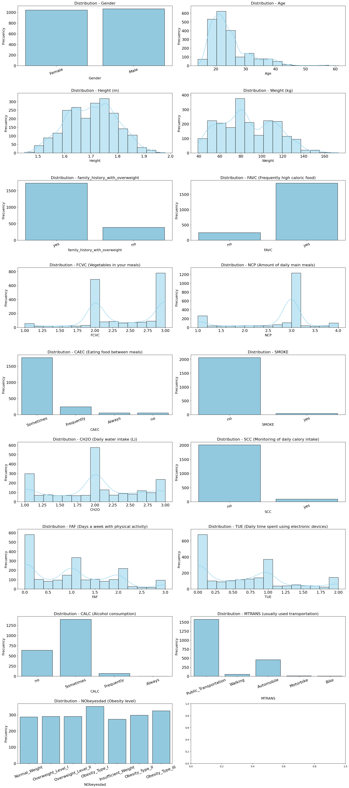

# Machine Learning, Exercise 0 Report
#### Nicolas Bernal (12347489), Richard Binder (01425185), Victor Olusesi (11776826)

# Data Set Choice
For this exercise we chose the data sets Bike Sharing and Obesity. 

## Bike Sharing
The Bike Sharing data set contains renting data from a bike sharing system in Washington D.C. from 2011 to 2012. The data set contains `17379 instances` and `16 non-target attributes`. The attributes are of type nominal, interval and ratio. None of the instances have missing values. This dataset aims to understand how different factors affect the number of bike rentals in a bike sharing system, including weather conditions, time of the day, holidays, etc. This dataset has not missing values.
And the types of attributes this dataset contains are: nominal, ordinal, interval and ratio.

For us this dataset is interesting to use in a "regression" context, since we can predict the number of bike rentals based on the weather conditions, time of the day, holidays, etc.

### Bike Sharing Attributes

| Attribute   | Type    | Range                                               |
|-------------|---------|-----------------------------------------------------|
| instant     | Ratio   | Unique ID for records                               |
| dteday      | Interval| Dates from 2011 to 2012                             |
| season      | Nominal | 1: winter, 2: spring, 3: summer, 4: fall            |
| yr          | Nominal | 0: 2011, 1: 2012                                    |
| mnth        | Ordinal | 1 to 12                                             |
| hr          | Ordinal | 0 to 23                                             |
| holiday     | Nominal | 0: no, 1: yes                                       |
| weekday     | Ordinal | 0 to 6                                              |
| workingday  | Nominal | 0: no, 1: yes                                       |
| weathersit  | Nominal | 1 to 4 (various weather conditions)                 |
| temp        | Ratio   | Normalized temperature in Celsius (0.02 to 1). The values are divided to 41 (max)              |
| atemp       | Ratio   | Normalized feeling temperature in Celsius  (0 to 1). The values are divided to 50 (max)        |
| hum         | Ratio   | Normalized humidity (0 to 1). The values are divided to 100 (max).                       |
| windspeed   | Ratio   | Normalized wind speed       (0 to 0.85). The values are divided to 67 (max)                       |
| casual      | Ratio   | Count of casual users       (0 to 367)                        |
| registered  | Ratio   | Count of registered users   (0 to 886)                       |
| cnt         | Ratio   | Count of total rental bikes (1 to 977)                        |

### Bike Sharing Target Attribute

| Attribute | Type    | Range                      |
|-----------|---------|----------------------------|
| cnt       | Ratio   | Count of total rental bikes|

### Preprocessing
To preprocessing the data, we will:
- Remove the `instant` attribute, since it is just an ID for the records and does not provide any useful information.
- Remove the `dteday` attribute, since we already have the `yr`, `mnth`, `hr`, `holiday`, `weekday`, and `workingday` attributes, which provide the same information in a more useful format.
- Transform the `season` attribute into 4 nominal attributes (winter, spring, summer, fall).
- Transform the `weathersit` attribute into 4 nominal attributes (one for each weather condition).

### Important Attributes
- `cnt` is the target attribute for the Bike Sharing dataset. It is a ratio attribute that represents the total number of bikes rented in a day. This attribute is important because it is the attribute we want to predict.
- `temp`, `atemp`, `hum`, and `windspeed` are the weather attributes that may influence the number of bike rentals. For example, the temperature and humidity can influence the number of bike rentals, since people are more likely to rent bikes when the weather is nice. The wind speed can also influence the number of bike rentals, since people are less likely to rent bikes when it is windy.
- `season`, `yr`, `mnth`, `hr`, `holiday`, `weekday`, and `workingday` are the time attributes that may influence the number of bike rentals, since depending on the season, year, month, hour, holiday, weekday, and working day, the number of bike rentals can vary. For example, people are more likely to rent bikes in the summer than in the winter, or on a working day than on a holiday.

### Histogram of the Bike Sharing Dataset

## Obesity
The Obesity data set, contains data from a survey of `2111 people (instances)` from Mexico, Peru and Colombia in order to determine the obesity level of the participants based on their eating habits, physical activities, etc. The data set contains `16 non-target attributes` and `1 class attribute`. The attributes are of type nominal, ordinal and ratio. None of the instances have missing values.

For us this dataset is interesting to use in a "classification" context, since we can predict the obesity level of a person based on their eating habits, physical activities, etc.

### Obesity Attributes

| Attribute                               | Type    | Range                                                |
|-----------------------------------------|---------|------------------------------------------------------|
| Gender                                  | Nominal | Male, Female                                         |
| Age                                     | Ratio   | Number (from 14 to 61)                               |
| Height                                  | Ratio   | Number in meters (from 1.45 to 1.98)                 |
| Weight                                  | Ratio   | Number in kg (from 39 to 173)                        |
| Family_history_with_overweight          | Nominal | Yes or No                                            |
| FAVC (Frequently high caloric food)     | Nominal | Yes or No                                            |
| FCVC (Vegetables in your meals)         | Ordinal | Never, Sometimes or Always                           |
| NCP (Amount of daily main meals)        | Ordinal | 1-2, 3, >3                                           |
| CAEC (Eating food between meals)        | Ordinal | No, Sometimes, Frequently, Always                    |
| SMOKE                                   | Nominal | Yes or No                                            |
| CH2O (Daily water intake)               | Ordinal | <1L, 1-2L, >2L                                       |
| SCC (Monitoring of daily calory intake) | Nominal | Yes or No                                            |
| FAF (Days a week with physical activity)| Ordinal | None, 1-2 Days, 2-4 days, 4-5 days                   |
| TUE (Daily time spent using electronic devices)| Ordinal | 0-2 hours, 3-5 hours, >5 hours                |
| CALC (Alcohol consumption)              | Ordinal | No drinking, sometimes, frequently, always           |
| MTRANS (usually used transportation)    | Nominal | Car, Motorbike, Bike, Public transportation, Walking |

### Obesity Target Attribute

| Attribute | Type    | Range                      |
|-----------|---------|----------------------------|
| NObeyesdad (Obesity level)   | Ordinal | Insufficient Weight, Normal Weight, Overweight Level I, Overweight Level II, Obesity Type I, Obesity Type II, and Obesity Type III |

### Preprocessing
- We can see that several attributes were distributed into "categories" and then transformed into numerical values. These attributes are:
    - `FCVC` (Vegetables in your meals)
    - `NCP` (Amount of daily main meals)
    - `CH2O` (Daily water intake)
    - `FAF` (Days a week with physical activity)
    - `TUE` (Daily time spent using electronic devices)

    These "categories" doesn't really have strong relationships between them (for example FCVC = 2 (Sometimes) is not "double" than FCVC = 1 ("Never")), therefore these attributes are ordinal and cannot be treated as numerical values. That's why we considered to treat them as nominal attributes, transforming each "category" into a binary attribute.

    Also the attributes:
    - `CAEC` (Eating food between meals)
    - `CALC` (Alcohol consumption)
    - `MTRANS` (usually used transportation) 
    
    Will be also receive the same processing as the ones before due to either be ordinal attributes or being nominal attributes with more than two values.

- For handling nominal attributes easily, we decided to transform the nominal attributes into binary values. For example: Yes = 1, No = 0. This applies to the following attributes:
    - `Gender` (Male = 1, Female = 0)
    - `Family_history_with_overweight`
    - `FAVC` (Frequently high caloric food)
    - `SMOKE`
    - `SCC` (Monitoring of daily calory intake)

- And for the ratio attributes, we decided to normalize them to a range of 0 to 1. This is done to help the model to keep all values in a similar range, helping the ML algorithm to understand the data better without losing information. This applies to the following attributes:
    - `Age`
    - `Height`
    - `Weight`

### Important Attributes
- `NObeyesdad` (Obesity level) is the class for the Obesity dataset. It is an ordinal attribute with 7 different classes. This attribute is important because it is the attribute we want to predict.

- `Weight` and `Height` are important attributes because they are the main factors that determine the obesity level of a person. Also the `Gender` attribute can influence the obesity level (BMI) for kids and teenagers between 2 and 20 years old.

- `Family_history_with_overweight`, `FAVC`, `SMOKE`, `CALC`, `MTRANS`, `NCP`, `FAF` and `FCVC` are factors that can influence directly or indirectly the obesity level of a person. For example, a person that has a family history with overweight is more likely to be overweight too. Or a person that has a high caloric food consumption is more likely to be overweight. These can also be interesting attributes to be predicted since the obesity level can be calculated based on `Weight` and `Height` therefore instead of predicting the obesity level, we can predict some of these attributes to find the main reasons that lead to a certain obesity level. 

### Histogram of the Obesity Dataset
